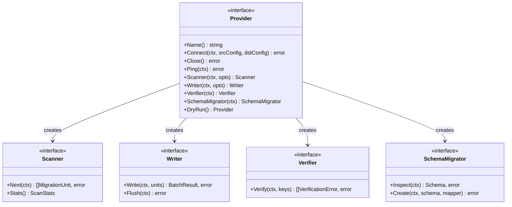

# Provider Architecture

Providers are the plugin layer that abstracts different database engines behind a common set of interfaces. Each database implements these interfaces in its own package under `providers/` and registers itself at init time via a global registry.

## Core interfaces

**File: `pkg/provider/provider.go`**

```go
// Provider is the top-level interface every database adapter implements.
type Provider interface {
    Name() string
    Connect(ctx context.Context, srcConfig, dstConfig any) error
    Close() error
    Ping(ctx context.Context) error
    Scanner(ctx context.Context, opts ScanOptions) Scanner
    Writer(ctx context.Context, opts WriteOptions) Writer
    Verifier(ctx context.Context) Verifier
    SchemaMigrator(ctx context.Context) SchemaMigrator
    DryRun() Provider
}
```

The `Provider` interface is a factory — it doesn't hold data itself but creates `Scanner`, `Writer`, `Verifier`, and `SchemaMigrator` instances on demand. This lets the pipeline create fresh instances for each run with their own options.



## Sub-interface responsibilities

### Scanner — reads from source

**Methods**: `Next(ctx) ([]MigrationUnit, error)`, `Stats() ScanStats`

Each scanner:

1. Enumerates all tables/collections (or uses `TablesCompleted` from checkpoint to skip).
2. Opens a cursor/query per table.
3. Reads rows/documents/keys and encodes each as a `MigrationUnit` with a provider-specific JSON envelope in the `Data` field.
4. Returns `io.EOF` when all data has been read.
5. Tracks `ScanStats` (total scanned, bytes, tables done/total).

| Provider    | File                               | Strategy                                             |
| ----------- | ---------------------------------- | ---------------------------------------------------- |
| MySQL       | `providers/mysql/scanner.go`       | `SHOW TABLES`, then `SELECT * FROM <table>` cursor   |
| PostgreSQL  | `providers/postgres/scanner.go`    | Same pattern with `information_schema`               |
| SQLite      | `providers/sqlite/scanner.go`      | `sqlite_master` for table list                       |
| MongoDB     | `providers/mongodb/scanner.go`     | `ListCollections`, then `Find` cursor per collection |
| Redis       | `providers/redis/scanner.go`       | `SCAN` cursor, then type-aware reads per key         |
| MariaDB     | `providers/mariadb/scanner.go`     | Same as MySQL                                        |
| CockroachDB | `providers/cockroachdb/scanner.go` | Same as PostgreSQL                                   |
| MSSQL       | `providers/mssql/scanner.go`       | `sys.tables` for enumeration                         |

### Writer — writes to destination

**Methods**: `Write(ctx, units) (*BatchResult, error)`, `Flush(ctx) error`

Each writer:

1. Decodes the JSON envelope from each `MigrationUnit.Data`.
2. Groups by table/collection for batch operations.
3. Applies conflict strategy (overwrite via upsert, skip via INSERT IGNORE, or error).
4. Returns a `BatchResult` with written/failed/skipped counts and per-key errors.

| Provider    | File                              | Strategy                                         |
| ----------- | --------------------------------- | ------------------------------------------------ |
| MySQL       | `providers/mysql/writer.go`       | Chunked `INSERT ... ON DUPLICATE KEY UPDATE`     |
| PostgreSQL  | `providers/postgres/writer.go`    | `INSERT ... ON CONFLICT DO UPDATE`               |
| SQLite      | `providers/sqlite/writer.go`      | `INSERT OR REPLACE`                              |
| MongoDB     | `providers/mongodb/writer.go`     | Bulk `UpdateOne` with `Upsert(true)`             |
| Redis       | `providers/redis/writer.go`       | Pipeline commands (`HSET`, `SET`, `RPUSH`, etc.) |
| MariaDB     | `providers/mariadb/writer.go`     | Same as MySQL                                    |
| CockroachDB | `providers/cockroachdb/writer.go` | Same as PostgreSQL                               |
| MSSQL       | `providers/mssql/writer.go`       | `MERGE` statement                                |

### Verifier — post-migration checks

**Methods**: `Verify(ctx, keys) ([]VerificationError, error)`

Checks that destination data matches source. Used for basic (destination-only) verification. For full cross-verification, providers also implement:

- `VerifyReader` — reads back records by key: `ReadRecords(ctx, keys) map[string]map[string]any`
- `TableEnumerator` — lists tables with row counts: `EnumerateTables(ctx) map[string]int64`
- `Checksummer` — computes row-level hashes: `ComputeChecksums(ctx, keys) map[string]string`

**File**: `providers/<name>/verifier.go`

### SchemaMigrator — DDL migration

**Methods**: `Inspect(ctx) (*Schema, error)`, `Create(ctx, *Schema, TypeMapper) error`

Only SQL databases implement this. NoSQL providers return `nil` from `SchemaMigrator()`.

- `Inspect` queries `information_schema` (or equivalent) to read tables, columns, indexes.
- `Create` generates DDL statements and applies an optional `TypeMapper` for cross-database type conversion.

**File**: `providers/<name>/schema.go`

### DryRun — logging wrapper

**File**: `providers/<name>/dryrun.go`

Every provider implements `DryRun()` which returns a wrapped `Provider` that logs all write operations without executing them. Used with `--dry-run` flag.

## Provider registry

**File: `pkg/provider/factory.go`**

Providers register themselves via `init()` functions in the `cmd/bridge/` directory:

```go
// pkg/provider/factory.go:16-24
func Register(name string, ctor func() Provider) {
    registryMu.Lock()
    defer registryMu.Unlock()
    if _, exists := registry[name]; exists {
        panic(fmt.Sprintf("provider %q already registered", name))
    }
    registry[name] = ctor
}
```

```go
// cmd/bridge/provider_mysql.go (simplified)
func init() {
    provider.Register("mysql", func() provider.Provider { return &mysqlProvider{} })
}
```

Lookup at runtime:

```go
// pkg/provider/factory.go:27-36
func New(name string) (Provider, error) {
    registryMu.RLock()
    ctor, ok := registry[name]
    registryMu.RUnlock()
    if !ok {
        return nil, fmt.Errorf("unknown provider %q", name)
    }
    return ctor(), nil
}
```

The `//go:build` tags in provider files (e.g. `//go:build mongodb` in `providers/mongodb/scanner.go`) mean providers are only compiled in when selected. The `cmd/bridge/` entry points conditionally import them.

## Capabilities system

**File: `pkg/provider/capabilities.go`**

Each provider declares its capabilities so the pipeline can adapt its behavior:

```go
type Capabilities struct {
    Schema       bool              // supports DDL schema inspection/creation
    Transactions bool              // supports multi-statement transactions
    Verification VerificationLevel // "none", "basic", or "cross"
    Incremental  bool              // supports resuming from checkpoint
}
```

### Static capability table

```go
// pkg/provider/capabilities.go:143-152
var knownCapabilities = map[string]Capabilities{
    "postgres":     {Schema: true,  Transactions: true,  Verification: VerifyCross, Incremental: true},
    "mysql":        {Schema: true,  Transactions: true,  Verification: VerifyCross, Incremental: true},
    "mariadb":      {Schema: true,  Transactions: true,  Verification: VerifyCross, Incremental: true},
    "cockroachdb":  {Schema: true,  Transactions: true,  Verification: VerifyCross, Incremental: true},
    "mssql":        {Schema: true,  Transactions: true,  Verification: VerifyCross, Incremental: true},
    "sqlite":       {Schema: true,  Transactions: false, Verification: VerifyCross, Incremental: true},
    "mongodb":      {Schema: true,  Transactions: true,  Verification: VerifyCross, Incremental: true},
    "redis":        {Schema: false, Transactions: false, Verification: VerifyCross, Incremental: true},
}
```

### Capability-derived decisions

| Decision                          | Gate                                                                 | File                    |
| --------------------------------- | -------------------------------------------------------------------- | ----------------------- |
| Run schema migration              | `src.Schema && dst.Schema`                                           | `pipeline.go:1076-1081` |
| Use transaction-based FK handling | `dst.Transactions`                                                   | `preflight.go:98-106`   |
| Cross-verification                | `src.Verification == VerifyCross && dst.Verification == VerifyCross` | `capabilities.go:72-80` |
| Basic verification                | Both support at least `VerifyBasic`                                  | `capabilities.go:72-80` |
| Skip verification                 | Neither supports any verification                                    | `pipeline.go:744-753`   |

### CapableProvider interface

Providers can optionally implement `CapableProvider` to declare capabilities dynamically:

```go
// pkg/provider/capabilities.go:93-96
type CapableProvider interface {
    Provider
    Capabilities() Capabilities
}
```

If not implemented, the pipeline falls back to probing legacy interfaces and inferring from the provider name (`inferCapabilities`, `capabilities.go:111-139`).

## Provider file structure

Every provider follows the same file layout:

```
providers/<name>/
├── provider.go      # Provider implementation (Connect, Close, Ping, factory methods)
├── scanner.go       # Scanner implementation (Next, Stats)
├── writer.go        # Writer implementation (Write, Flush)
├── verifier.go      # Verifier implementation (Verify, optional VerifyReader/Checksummer)
├── schema.go        # SchemaMigrator implementation (Inspect, Create) — nil for NoSQL
├── types.go         # Provider-specific envelope types, encode/decode helpers
└── dryrun.go        # DryRun wrapper
```

### Type files

Each provider defines envelope types for its native data format:

**`providers/mysql/types.go`** (representative):

```go
type mysqlRow struct {
    Table       string         `json:"table"`
    Schema      string         `json:"schema,omitempty"`
    PrimaryKey  map[string]any `json:"primary_key"`
    Data        map[string]any `json:"data"`
    ColumnTypes map[string]string `json:"column_types"`
}
```

**`providers/mongodb/types.go`**:

```go
type mongoDocument struct {
    Collection string `json:"collection"`
    DocumentID any    `json:"document_id"`
    Data       []byte `json:"document"` // raw BSON
}
```

**`providers/redis/types.go`**:

```go
type redisKeyData struct {
    Type       string `json:"type"`
    Value      any    `json:"value"`
    TTLSeconds int64  `json:"ttl_seconds"`
}
```

## All supported providers

| Provider    | Package                 | Engine type | Schema | Transactions | Verification |
| ----------- | ----------------------- | ----------- | ------ | ------------ | ------------ |
| PostgreSQL  | `providers/postgres`    | SQL         | Yes    | Yes          | Cross        |
| MySQL       | `providers/mysql`       | SQL         | Yes    | Yes          | Cross        |
| MariaDB     | `providers/mariadb`     | SQL         | Yes    | Yes          | Cross        |
| CockroachDB | `providers/cockroachdb` | SQL         | Yes    | Yes          | Cross        |
| MSSQL       | `providers/mssql`       | SQL         | Yes    | Yes          | Cross        |
| SQLite      | `providers/sqlite`      | SQL         | Yes    | No           | Cross        |
| MongoDB     | `providers/mongodb`     | Document    | Yes\*  | Yes          | Cross        |
| Redis       | `providers/redis`       | Key-value   | No     | No           | Cross        |

\*MongoDB has Schema=true for index migration, but does not produce DDL schemas.

## Files involved

| File                            | Role                                                    |
| ------------------------------- | ------------------------------------------------------- |
| `pkg/provider/provider.go`      | All core interfaces, data types, options                |
| `pkg/provider/capabilities.go`  | Capabilities struct, resolution, inference              |
| `pkg/provider/factory.go`       | Provider registry (Register/New)                        |
| `pkg/provider/scanner_util.go`  | Shared `UnmarshalScanToken` (used by all scanners)      |
| `pkg/provider/hostport.go`      | Shared `ParseHostPort` with default port                |
| `internal/config/resolve.go`    | Generic `ResolveConfig[T]` for provider config dispatch |
| `internal/config/overrides.go`  | `ApplyOverrides` for CLI flag → config application      |
| `internal/util/format.go`       | Shared `HumanBytes` and `Truncate` utilities            |
| `providers/<name>/provider.go`  | Per-provider Provider implementation                    |
| `providers/<name>/scanner.go`   | Per-provider Scanner implementation                     |
| `providers/<name>/writer.go`    | Per-provider Writer implementation                      |
| `providers/<name>/verifier.go`  | Per-provider Verifier implementation                    |
| `providers/<name>/schema.go`    | Per-provider SchemaMigrator (SQL only)                  |
| `providers/<name>/types.go`     | Envelope types and encode/decode                        |
| `providers/<name>/dryrun.go`    | DryRun wrapper                                          |
| `cmd/bridge/provider_<name>.go` | Provider registration (init)                            |
