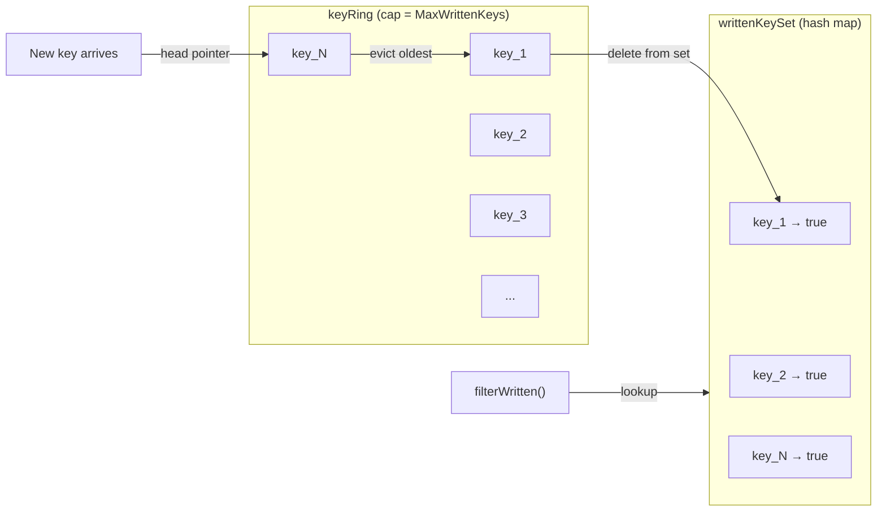

# Checkpoint and Resume

The checkpoint system enables migration resumption after interruption. Progress is saved to a JSON file after each successful batch write (or at a configurable interval), and can be restored on the next run with `--resume`.

## Checkpoint structure

**File: `internal/bridge/checkpoint.go:18-73`**

```go
type Checkpoint struct {
    SourceProvider    string    `json:"source_provider"`   // e.g. "mysql"
    DestProvider      string    `json:"dest_provider"`     // e.g. "mongodb"
    ConfigHash        string    `json:"config_hash"`       // SHA-256 of key config fields
    StartTime         time.Time `json:"start_time"`
    LastBatchID       int       `json:"last_batch_id"`
    TotalWritten      int64     `json:"total_written"`
    TablesCompleted   []string  `json:"tables_completed"`
    LastTableScanning string    `json:"last_table_scanning,omitempty"`
    RowsScannedInTable int64    `json:"rows_scanned_in_table,omitempty"`
    WrittenKeys       []string  `json:"written_keys,omitempty"`
    ResumeToken       []byte    `json:"resume_token,omitempty"`
    Timestamp         time.Time `json:"timestamp"`
    Version           int       `json:"version"`
    Checksum          string    `json:"checksum,omitempty"`
}
```

| Field               | Purpose                                                             |
| ------------------- | ------------------------------------------------------------------- |
| `SourceProvider`    | Validates that resumed run matches original source                  |
| `DestProvider`      | Validates that resumed run matches original destination             |
| `ConfigHash`        | Detects incompatible config changes between runs (SHA-256)          |
| `StartTime`         | Original migration start time (carried forward on resume)           |
| `LastBatchID`       | Resume writes start from this ID + 1                                |
| `TotalWritten`      | Cumulative units written (for progress display on resume)           |
| `TablesCompleted`   | Tables whose scanner cursor was fully exhausted — skipped on resume |
| `LastTableScanning` | Table in progress when checkpoint was saved (diagnostic only)       |
| `WrittenKeys`       | Keys written since last fully-completed table (for dedup on resume) |
| `ResumeToken`       | Opaque scanner cursor (provider-specific stats)                     |
| `Checksum`          | SHA-256 over all other fields for corruption detection              |

## FileCheckpointStore

**File: `internal/bridge/checkpoint.go:157-257`**

Persists checkpoints as JSON files with atomic writes:

```go
type FileCheckpointStore struct {
    path string
    mu   sync.Mutex
}
```

### Save (atomic write)

```go
// internal/bridge/checkpoint.go:176-204
func (s *FileCheckpointStore) Save(_ context.Context, cp *Checkpoint) error {
    s.mu.Lock()
    defer s.mu.Unlock()

    cp.Checksum = cp.computeChecksum() // compute before serializing

    data, _ := sonic.MarshalIndent(cp, "", "  ")

    // Write to temp file, then rename (atomic)
    tmpPath := s.path + ".tmp"
    os.MkdirAll(filepath.Dir(s.path), 0o755)
    os.WriteFile(tmpPath, data, 0o600)
    os.Rename(tmpPath, s.path) // atomic on POSIX
}
```

The write is atomic: data is written to a `.tmp` file, then renamed. If the process crashes during write, the original file remains intact.

### Load (with validation)

```go
// internal/bridge/checkpoint.go:208-245
func (s *FileCheckpointStore) Load(_ context.Context) (*Checkpoint, error) {
    data, _ := os.ReadFile(s.path)
    if len(data) == 0 { return nil, nil }

    var cp Checkpoint
    sonic.Unmarshal(data, &cp)

    // Validate version compatibility
    cp.Validate()

    // Verify checksum for corruption detection
    if cp.Checksum != "" {
        expected := cp.computeChecksum()
        if cp.Checksum != expected {
            return nil, fmt.Errorf("checkpoint checksum mismatch")
        }
    }

    return &cp, nil
}
```

### Clear

```go
func (s *FileCheckpointStore) Clear(_ context.Context) error {
    os.Remove(s.path) // called on successful completion or fresh start
}
```

## Checksum computation

**File: `internal/bridge/checkpoint.go:108-141`**

A SHA-256 hash over all checkpoint fields (excluding the checksum itself):

```go
func (cp *Checkpoint) computeChecksum() string {
    h := sha256.New()
    h.Write([]byte(cp.SourceProvider))
    h.Write([]byte(cp.DestProvider))
    h.Write([]byte(cp.ConfigHash))
    h.Write([]byte(cp.StartTime.Format(time.RFC3339Nano)))
    fmt.Fprintf(h, "%d", cp.LastBatchID)
    fmt.Fprintf(h, "%d", cp.TotalWritten)
    for _, t := range cp.TablesCompleted { h.Write([]byte(t)) }
    h.Write([]byte(cp.LastTableScanning))
    fmt.Fprintf(h, "%d", cp.RowsScannedInTable)
    for _, k := range cp.WrittenKeys { h.Write([]byte(k)) }
    h.Write(cp.ResumeToken)
    h.Write([]byte(cp.Timestamp.Format(time.RFC3339Nano)))
    fmt.Fprintf(h, "%d", cp.Version)
    return hex.EncodeToString(h.Sum(nil))
}
```

## When checkpoints are saved

**File: `internal/bridge/pipeline.go:916-993`**

### Throttled saving

```go
// internal/bridge/pipeline.go:916-928
func (p *Pipeline) maybeCheckpoint(ctx context.Context, batchID int, scanner provider.Scanner) {
    p.cpMu.Lock()
    p.batchesSinceCP++
    shouldSave := p.opts.CheckpointInterval == 0 || p.batchesSinceCP >= p.opts.CheckpointInterval
    if shouldSave { p.batchesSinceCP = 0 }
    p.cpMu.Unlock()

    if shouldSave {
        p.saveCheckpoint(ctx, batchID, scanner)
    }
}
```

- `CheckpointInterval == 0` (default): save after every successful batch. Safest, but adds I/O overhead.
- `CheckpointInterval > 0`: save every N batches. Faster for high-throughput migrations, but loses more progress on crash.

### Checkpoint content

```go
// internal/bridge/pipeline.go:931-993
func (p *Pipeline) saveCheckpoint(ctx context.Context, batchID int, scanner provider.Scanner) {
    p.cpMu.Lock()
    defer p.cpMu.Unlock()

    stats := scanner.Stats()

    // Get current written keys from ring buffer
    p.keyMu.Lock()
    keysFlat := p.writtenKeysFlat()
    totalWritten := p.totalWritten
    p.keyMu.Unlock()

    // Build resume token from scanner stats
    var token []byte
    if stats.TotalScanned > 0 {
        token = encodeResumeToken(p.config.Source.Provider, stats, keysFlat)
    }

    // Determine completed tables (scanner cursor fully exhausted)
    completedCount := stats.TablesDone
    completedTables := make([]string, completedCount)
    copy(completedTables, p.scannedTables[:completedCount])

    // Track in-progress table
    var lastTableScanning string
    if completedCount < len(p.scannedTables) {
        lastTableScanning = p.scannedTables[completedCount]
    }

    cp := &Checkpoint{
        SourceProvider:    p.config.Source.Provider,
        DestProvider:      p.config.Destination.Provider,
        ConfigHash:        computeConfigHash(p.config),
        StartTime:         p.startTime,
        LastBatchID:       batchID,
        TotalWritten:      totalWritten,
        TablesCompleted:   completedTables,
        LastTableScanning: lastTableScanning,
        WrittenKeys:       keysFlat,
        ResumeToken:       token,
        Timestamp:         time.Now(),
        Version:           checkpointVersion,
    }
    p.checkpoint.Save(ctx, cp)
}
```

### Final checkpoint on cancellation

When the pipeline is cancelled (SIGINT or `Cancel()`), a final checkpoint is saved:

```go
// internal/bridge/pipeline.go:675-678
if err := ctx.Err(); err != nil {
    p.saveCheckpoint(context.Background(), int(lastWrittenBatchID.Load()), scanner)
    return p.abort(NewCancelledError("Migration was cancelled", err))
}
```

## Resume flow

### Step 4: Load checkpoint

**File: `internal/bridge/pipeline.go:352-360`**

```go
if p.opts.CheckpointEnabled {
    ms.checkpoint, err = p.checkpoint.Load(ctx)
    // On error: log warning, start fresh
}
```

### Step 5: Restore state

**File: `internal/bridge/pipeline.go:386-462`**

```go
if ms.checkpoint != nil && p.opts.Resume {
    // 1. Validate config hash
    currentHash := computeConfigHash(p.config)
    if ms.checkpoint.ConfigHash != currentHash {
        return error // config changed since checkpoint
    }

    // 2. Validate provider names
    if ms.checkpoint.SourceProvider != p.config.Source.Provider { return error }
    if ms.checkpoint.DestProvider != p.config.Destination.Provider { return error }

    // 3. Restore written keys for dedup
    for _, k := range ms.checkpoint.WrittenKeys {
        p.writtenKeySet[k] = true
    }

    // 4. Restore ring buffer
    ringSize := max(len(ms.checkpoint.WrittenKeys), p.opts.MaxWrittenKeys)
    ring := make([]string, ringSize)
    copy(ring, ms.checkpoint.WrittenKeys)
    p.keyRing = ring
    p.keyRingLen = len(ms.checkpoint.WrittenKeys)
    p.keyRingHead = len(ms.checkpoint.WrittenKeys) % ringSize
    p.totalWritten = ms.checkpoint.TotalWritten

    result.Resumed = true

    // 5. Warn if dedup cap was exceeded
    if ms.checkpoint.TotalWritten > int64(p.opts.MaxWrittenKeys) {
        if p.opts.ConflictStrategy != provider.ConflictOverwrite {
            return error // can't resume with skip/error strategy
        }
        // With overwrite: evicted keys will be re-written (harmless)
    }
}
```

### Scanner resume

The restored `TablesCompleted` list is passed to the scanner via `ScanOptions`:

```go
scanOpts := provider.ScanOptions{
    BatchSize:       p.opts.BatchSize,
    ResumeToken:     resumeToken(ms.checkpoint),
    TablesCompleted: tablesCompleted(ms.checkpoint),
}
scanner := p.src.Scanner(ctx, scanOpts)
```

Each scanner uses `TablesCompleted` to skip fully-scanned tables:

```go
// providers/mysql/scanner.go:189-201
if len(s.tablesCompleted) > 0 {
    filtered := tables[:0]
    for _, t := range tables {
        if !s.tablesCompleted[t] {
            filtered = append(filtered, t)
        }
    }
    s.tables = filtered // only scan incomplete tables
}
```

### Dedup on resume

For tables that were in progress when the checkpoint was saved, the scanner re-reads them from the beginning. The `WrittenKeys` set prevents duplicate writes:

```go
// internal/bridge/batch_writer.go:175-188
func (p *Pipeline) filterWritten(units []provider.MigrationUnit) ([]provider.MigrationUnit, int) {
    p.keyMu.Lock()
    defer p.keyMu.Unlock()

    var filtered []provider.MigrationUnit
    for _, u := range units {
        if p.writtenKeySet[u.Key] {
            skipped++ // already written, skip
            continue
        }
        filtered = append(filtered, u)
    }
    return filtered, skipped
}
```

## Config hash

**File: `internal/bridge/pipeline.go:1313-1355`**

A deterministic SHA-256 hash over config fields that affect migration correctness:

```go
func computeConfigHash(cfg *config.MigrationConfig) string {
    h := sha256.New()
    h.Write([]byte(cfg.Source.Provider))
    h.Write([]byte(cfg.Destination.Provider))
    h.Write([]byte(hostFromConnection(cfg.Source)))
    fmt.Fprintf(h, "%d", portFromConnection(cfg.Source))
    h.Write([]byte(dbFromConnection(cfg.Source)))
    h.Write([]byte(hostFromConnection(cfg.Destination)))
    fmt.Fprintf(h, "%d", portFromConnection(cfg.Destination))
    h.Write([]byte(dbFromConnection(cfg.Destination)))
    fmt.Fprintf(h, "%d", cfg.Pipeline.BatchSize)
    h.Write([]byte(string(cfg.Pipeline.ConflictStrategy)))
    h.Write([]byte(cfg.Pipeline.FKHandling))
    for table, mappings := range cfg.Transform.Mappings {
        h.Write([]byte(table))
        for _, m := range mappings {
            h.Write([]byte(m.Source))
            h.Write([]byte(m.Destination))
        }
    }
    return hex.EncodeToString(h.Sum(nil))
}
```

If the hash differs between runs, resume is refused with a clear error message.

## Key tracking ring buffer

**File: `internal/bridge/pipeline.go:857-895`**

Written keys are tracked in a fixed-capacity ring buffer (`--max-written-keys`, default 100,000):



- **Insert**: write key at `keyRingHead`, advance head pointer modulo cap.
- **Evict**: when ring is full, delete the oldest key from `writtenKeySet` before overwriting.
- **Lookup**: `filterWritten` checks `writtenKeySet` (O(1) hash map lookup).

When the cap is exceeded:

- With `overwrite` strategy: evicted keys are harmlessly re-written.
- With `skip` or `error` strategy: resume is refused at step 5 to prevent duplicate-key errors.

## Version compatibility

**File: `internal/bridge/checkpoint.go:75-104`**

```go
const checkpointVersion = 3
const minSupportedVersion = 3
```

- Checkpoints with version < `minSupportedVersion` are rejected (older semantics).
- Checkpoints with version > `checkpointVersion` are rejected (newer binary).
- This prevents silent data loss from incompatible checkpoint formats.

## Guarantees

| Guarantee                      | Mechanism                                            |
| ------------------------------ | ---------------------------------------------------- |
| No partial checkpoint files    | Atomic write via temp file + rename                  |
| Corruption detection           | SHA-256 checksum over all fields                     |
| Config change detection        | SHA-256 config hash compared on resume               |
| No duplicate writes on resume  | WrittenKeys set + filterWritten()                    |
| Fully-scanned tables skipped   | TablesCompleted passed to scanner via ScanOptions    |
| In-progress tables re-scanned  | Scanner re-reads from beginning, dedup prevents dups |
| Cancelled migrations resumable | Final checkpoint saved on context cancellation       |
| Completed migrations clean up  | Checkpoint file deleted in step 10 (finalize)        |

## Files involved

| File                                      | Role                                                             |
| ----------------------------------------- | ---------------------------------------------------------------- |
| `internal/bridge/checkpoint.go`           | `Checkpoint` struct, `FileCheckpointStore`, checksum, validation |
| `internal/bridge/pipeline.go:348-379`     | Step 4: Load checkpoint                                          |
| `internal/bridge/pipeline.go:383-462`     | Step 5: Restore state + validate                                 |
| `internal/bridge/pipeline.go:916-993`     | `maybeCheckpoint` and `saveCheckpoint`                           |
| `internal/bridge/pipeline.go:857-909`     | `recordKeys` ring buffer and `writtenKeysFlat`                   |
| `internal/bridge/batch_writer.go:175-188` | `filterWritten` dedup                                            |
| `internal/bridge/pipeline.go:1259-1274`   | `encodeResumeToken`                                              |
| `internal/bridge/pipeline.go:1313-1355`   | `computeConfigHash`                                              |
| `internal/config/config.go:489-501`       | `CheckpointConfig` (path, enabled)                               |
