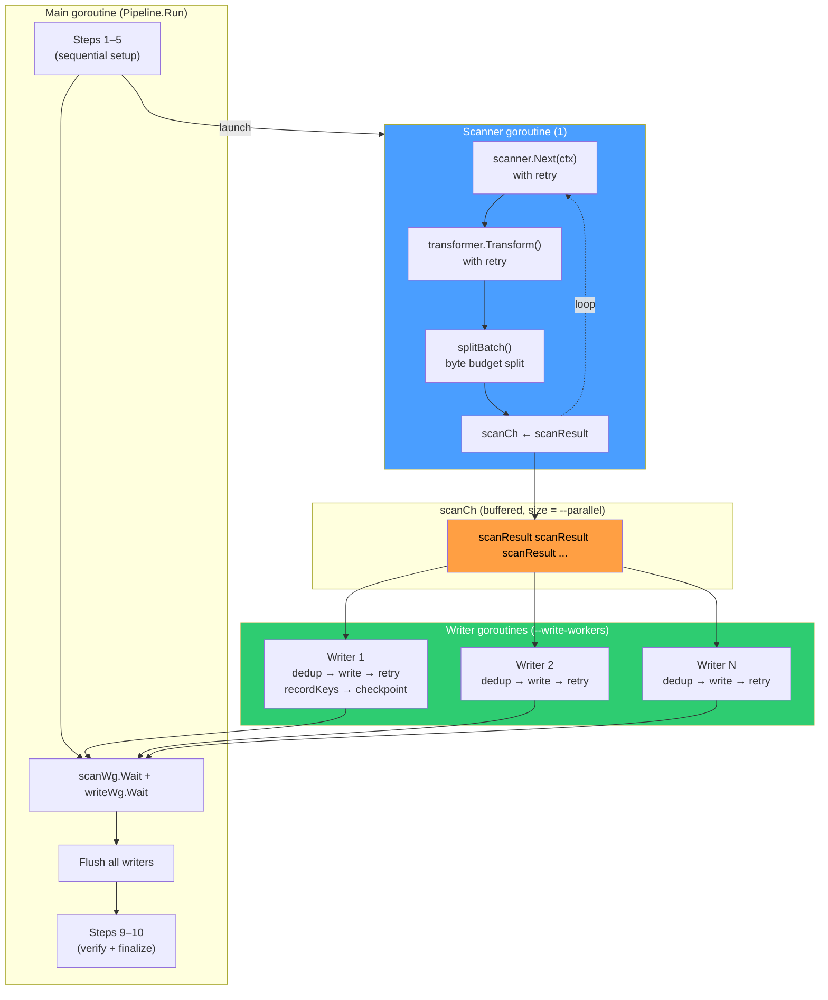
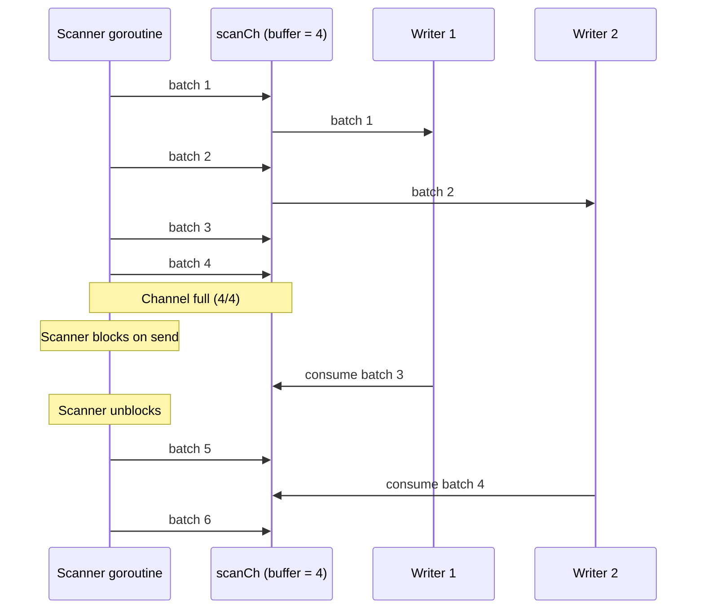
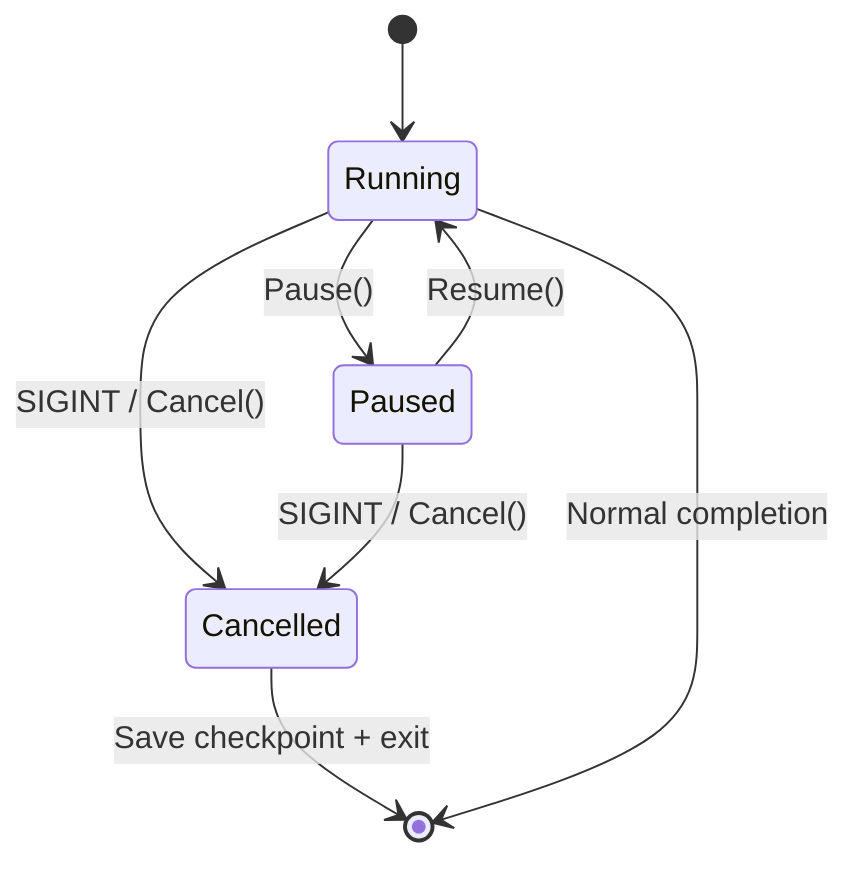

# Concurrency Model

The pipeline uses a producer-consumer pattern with a single scanner goroutine feeding N writer goroutines through a buffered channel. This document explains the goroutine layout, backpressure behavior, key dedup, and lifecycle controls.

## Goroutine layout

**File: `internal/bridge/pipeline.go:474-687`**



### Scanner goroutine (producer)

**File: `internal/bridge/pipeline.go:502-599`**

A single goroutine reads batches from the source scanner, transforms them inline, and produces into the channel:

```go
scanCh := make(chan scanResult, p.opts.Parallel)

go func() {
    defer scanWg.Done()
    defer close(scanCh) // signal writers to stop

    for {
        // Step 6: Extract — read next batch from source
        units, err := scanner.Next(ctx)
        if err == io.EOF { return }

        // Retry on transient scan errors
        retry.Do(ctx, retryCfg, func() error {
            units, err = scanner.Next(ctx)
            if err == io.EOF { return nil }
            return err
        })

        // Step 7: Transform (if cross-DB)
        if !transform.IsNoopTransformer(p.transformer) {
            retry.Do(ctx, transformRetryCfg, func() error {
                units, terr = p.transformer.Transform(ctx, units)
                return terr
            })
        }

        // Split by byte budget
        for _, sub := range splitBatch(units, p.opts.MaxBatchBytes) {
            batchID++
            select {
            case scanCh <- scanResult{batchID: batchID, units: sub}:
            case <-ctx.Done():
                return
            }
        }
    }
}()
```

Key points:

- The scanner goroutine **closes** `scanCh` when done, which signals all writer goroutines to exit their `range` loops.
- `splitBatch` (`pipeline.go:1002-1022`) splits oversized batches at `MaxBatchBytes` boundaries (default 32 MiB).
- Scan errors are sent through the channel as `scanResult{err: err}` so writers can report them.

### Writer goroutines (consumers)

**File: `internal/bridge/pipeline.go:601-658`**

N writer goroutines consume from the channel and persist to the destination:

```go
numWorkers := p.opts.WriteWorkers
batchWriters := make([]*batchWriter, numWorkers)
for i := range batchWriters {
    batchWriters[i] = &batchWriter{
        w: p.dst.Writer(ctx, writeOpts),
        cfg: writeConfig{
            MaxRetries:       p.opts.MaxRetries,
            RetryBackoff:     p.opts.RetryBackoff,
            ConflictStrategy: p.opts.ConflictStrategy,
            MaxPerUnitRetry:  min(p.opts.MaxRetries+1, 50),
        },
    }
}

for i := 0; i < numWorkers; i++ {
    writeWg.Add(1)
    go func(bw *batchWriter) {
        defer writeWg.Done()
        for sr := range scanCh { // exits when scanCh is closed
            p.waitIfPaused() // check pause state

            if sr.err != nil {
                // Report scan errors, skip this batch
                continue
            }

            out := bw.writeBatch(ctx, p, sr.units)
            processWriteOutcome(out, sr.batchID, sr.units, p, ...)

            if out.writeErr == nil && out.result != nil {
                lastWrittenBatchID.Store(int64(sr.batchID))
                p.maybeCheckpoint(ctx, sr.batchID, scanner)
            }
        }
    }(batchWriters[i])
}
```

Key points:

- Each writer goroutine gets its own `batchWriter` instance with its own `provider.Writer` — no shared mutable state between workers.
- Workers read from the same channel, so batches are distributed round-robin by Go's runtime scheduler.
- Only the writer that successfully wrote a batch triggers checkpoint saving.

### Coordination

```go
// Wait for scanner to finish producing
scanWg.Wait()

// Wait for all writers to drain the channel
writeWg.Wait()

// Flush all writer instances
for _, bw := range batchWriters {
    bw.flush(ctx)
}
```

## batchWriter internals

**File: `internal/bridge/batch_writer.go`**

Each batch write goes through 4 stages:


### Stage 1: Dedup filtering

**File: `internal/bridge/batch_writer.go:175-188`**

```go
func (p *Pipeline) filterWritten(units []provider.MigrationUnit) ([]provider.MigrationUnit, int) {
    p.keyMu.Lock()
    defer p.keyMu.Unlock()

    filtered := make([]provider.MigrationUnit, 0, len(units))
    skipped := 0
    for _, u := range units {
        if p.writtenKeySet[u.Key] {
            skipped++
            continue // already written in this run
        }
        filtered = append(filtered, u)
    }
    return filtered, skipped
}
```

### Stage 2: Batch write with retry

**File: `internal/bridge/batch_writer.go:78-95`**

```go
var result *provider.BatchResult
retryCfg := retry.Config{
    MaxAttempts:     bw.cfg.MaxRetries + 1,
    InitialInterval: bw.cfg.RetryBackoff,
    MaxInterval:     30 * time.Second,
    Multiplier:      2.0,
}
writeErr := retry.Do(ctx, retryCfg, func() error {
    var werr error
    result, werr = bw.w.Write(ctx, deduped)
    return werr
})
```

### Stage 3: Partial failure recovery

**File: `internal/bridge/batch_writer.go:114-162`**

If `Write()` succeeded but reported `FailedKeys`, those units are retried individually:

```go
if len(result.FailedKeys) > 0 && bw.cfg.MaxPerUnitRetry > 0 {
    failedUnits := unitsByKeys(deduped, result.FailedKeys)
    for _, unit := range failedUnits {
        singleResult, err := bw.w.Write(ctx, []provider.MigrationUnit{unit})
        if err != nil || singleResult.WrittenUnits == 0 {
            out.unitErrors = append(out.unitErrors, unitError{key: unit.Key, err: err})
            continue
        }
        // Update batch result counts
        batchResult.WrittenUnits++
        batchResult.FailedUnits--
    }
}
```

### Stage 4: Key tracking and metrics

**File: `internal/bridge/pipeline.go:857-895`**

```go
func (p *Pipeline) recordKeys(units []provider.MigrationUnit) {
    p.keyMu.Lock()
    defer p.keyMu.Unlock()

    for _, u := range units {
        if p.writtenKeySet[u.Key] { continue }
        p.writtenKeySet[u.Key] = true

        // Evict oldest entry if ring buffer is full
        if p.keyRingLen >= cap {
            evictIdx := p.keyRingHead
            delete(p.writtenKeySet, p.keyRing[evictIdx])
            p.keyRingLen--
        }

        p.keyRing[p.keyRingHead] = u.Key
        p.keyRingHead = (p.keyRingHead + 1) % cap
        p.keyRingLen++
    }
    p.totalWritten += int64(len(units))
}
```

## Backpressure

The buffered channel acts as a natural backpressure mechanism:



When the channel is full (`--parallel` slots occupied), the scanner goroutine blocks on `scanCh <- scanResult{...}`. It unblocks only when a writer finishes and takes a batch from the channel.

**Tuning tradeoffs**:

| Scenario                       | Solution                                             |
| ------------------------------ | ---------------------------------------------------- |
| Writers idle, scanner slow     | Increase `--batch-size` or use a faster source query |
| Scanner blocked, writers slow  | Increase `--write-workers` or reduce `--batch-size`  |
| Memory pressure                | Decrease `--parallel` (smaller channel buffer)       |
| Large rows overwhelming memory | Set `--max-batch-bytes` to split oversized batches   |

## Mutex usage

The pipeline uses several mutexes to protect shared state across goroutines:

| Mutex       | Field                | Protects                                        | File              |
| ----------- | -------------------- | ----------------------------------------------- | ----------------- |
| `keyMu`     | `sync.Mutex`         | `keyRing`, `writtenKeySet`, `totalWritten`      | `pipeline.go:70`  |
| `cpMu`      | `sync.Mutex`         | `batchesSinceCP`, checkpoint save serialization | `pipeline.go:72`  |
| `errorsMu`  | `sync.Mutex` (local) | `allErrors` slice                               | `pipeline.go:496` |
| `pauseCond` | `sync.Cond`          | Pause/resume state                              | `pipeline.go:75`  |

The `lastWrittenBatchID` uses `atomic.Int64` (no mutex) for lock-free updates.

## Pause and cancel

**File: `internal/bridge/pipeline.go:819-848`**

```go
// Pause suspends at the next batch boundary
func (p *Pipeline) Pause() {
    p.paused.Store(true)
    p.reporter.OnPhaseChange(provider.PhasePaused)
}

// Resume unblocks paused writers
func (p *Pipeline) Resume() {
    p.paused.Store(false)
    p.pauseCond.Broadcast()
}

// Cancel aborts via context
func (p *Pipeline) Cancel() {
    if p.cancelFn != nil { p.cancelFn() }
}
```

Writer goroutines check pause at each batch:

```go
func (p *Pipeline) waitIfPaused() {
    if !p.paused.Load() { return }
    p.pauseCond.L.Lock()
    for p.paused.Load() {
        p.pauseCond.Wait() // blocks until Resume() broadcasts
    }
    p.pauseCond.L.Unlock()
}
```



On cancellation, the pipeline saves a final checkpoint so `--resume` can pick up where it left off:

```go
// internal/bridge/pipeline.go:675-678
if err := ctx.Err(); err != nil {
    p.saveCheckpoint(context.Background(), int(lastWrittenBatchID.Load()), scanner)
    return p.abort(NewCancelledError("Migration was cancelled", err).WithStep(8))
}
```

## PipelineOptions controlling concurrency

**File: `internal/bridge/options.go`**

| Option               | Default | Controls                                   |
| -------------------- | ------- | ------------------------------------------ |
| `Parallel`           | 4       | Channel buffer depth (backpressure cap)    |
| `WriteWorkers`       | 1       | Number of concurrent writer goroutines     |
| `BatchSize`          | 1000    | Units per batch                            |
| `MaxBatchBytes`      | 32 MiB  | Byte budget per batch (triggers split)     |
| `MaxWrittenKeys`     | 100,000 | Key dedup ring buffer capacity             |
| `MaxRetries`         | 3       | Write retry attempts per batch             |
| `RetryBackoff`       | 500ms   | Initial retry delay                        |
| `CheckpointInterval` | 0       | Batches between checkpoint saves (0=every) |
| `FailFast`           | false   | Abort on first transform error             |

## Files involved

| File                                  | Role                                                 |
| ------------------------------------- | ---------------------------------------------------- |
| `internal/bridge/pipeline.go:474-687` | Scanner + writer goroutine orchestration             |
| `internal/bridge/pipeline.go:819-848` | Pause/resume/cancel lifecycle                        |
| `internal/bridge/pipeline.go:857-895` | Key tracking ring buffer                             |
| `internal/bridge/batch_writer.go`     | Per-worker write logic (dedup, retry, partial)       |
| `internal/bridge/options.go`          | PipelineOptions defaults and validation              |
| `internal/retry/retry.go`             | Exponential backoff retry, `ConnectionRetryConfig()` |
| `internal/progress/reporter.go`       | Metrics collection and TUI reporting                 |
| `internal/util/format.go`             | Shared `HumanBytes` and `Truncate` formatting        |
