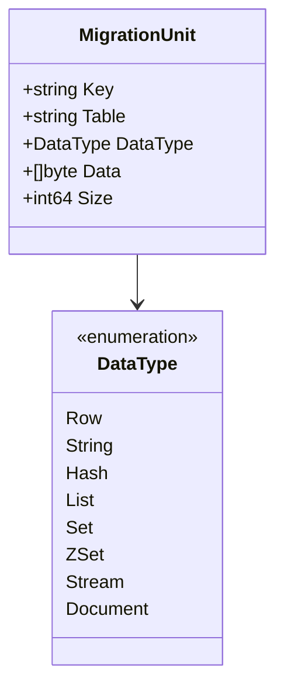
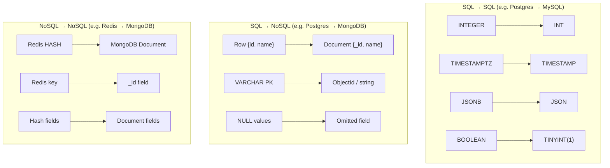

# Data Flow Diagram

Data flows through the pipeline as `MigrationUnit` structs — a provider-agnostic envelope that carries a key, table name, data type, and serialized payload.

## MigrationUnit structure



## End-to-end data flow

```mermaid
flowchart LR
    subgraph Source["Source Database"]
        SDB[(Postgres / MySQL /<br/>MongoDB / Redis)]
    end

    subgraph Extract
        SC[Scanner<br/>scanner.Next]
    end

    subgraph Transform["Transform (if cross-DB)"]
        TM[Transformer<br/>type mapping +<br/>field conversion]
    end

    subgraph Write
        WR[Writer<br/>writer.Write]
    end

    subgraph Dest["Destination Database"]
        DDB[(MySQL / MongoDB /<br/>Redis / etc.)]
    end

    SDB -->|SQL rows /<br/>documents / keys| SC
    SC -->|[]MigrationUnit| TM
    TM -->|[]MigrationUnit<br/>(converted format)| WR
    WR -->|INSERT / PUT /<br/>bulk write| DDB
```

## Data encoding examples

Each provider serializes its native format into the `Data []byte` field as a JSON envelope:

**SQL row → MigrationUnit**

```json
{
  "table": "users",
  "schema": "public",
  "primary_key": "id:42",
  "data": { "id": 42, "name": "Alice", "email": "alice@example.com" },
  "column_types": { "id": "integer", "name": "varchar", "email": "varchar" }
}
```

**MongoDB document → MigrationUnit**

```json
{
  "collection": "orders",
  "document_id": "507f1f77bcf86cd799439011",
  "document": { "_id": "507f1f77...", "total": 99.95, "items": 3 }
}
```

**Redis key → MigrationUnit**

```json
{
  "type": "hash",
  "key": "session:abc123",
  "value": { "user_id": "42", "expires": "1700000000" }
}
```

## Cross-DB transformation examples

When source and destination use different engines, the transformer converts between formats:


