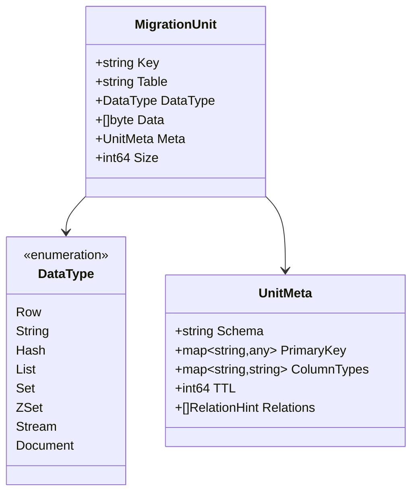
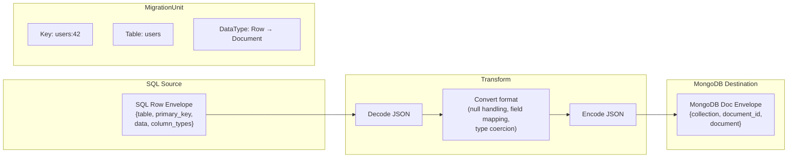

# Data Model: MigrationUnit

`MigrationUnit` is the fundamental unit of data that flows through the pipeline. It is a provider-agnostic envelope that carries a single piece of data — one SQL row, one MongoDB document, or one Redis key — from source to destination.

**File: `pkg/provider/provider.go:87-111`**

## Structure

```go
type MigrationUnit struct {
    Key      string   // Unique identifier
    Table    string   // Table or collection name (empty for Redis)
    DataType DataType // Classifies the payload so the writer knows how to deserialize
    Data     []byte   // Serialized value as a JSON envelope
    Meta     UnitMeta // Typed metadata extracted from the envelope
    Size     int64    // Approximate byte size of Data
}
```



## Key field

The `Key` uniquely identifies the unit across the migration. Its format depends on the source provider:

| Source     | Key format         | Example                  |
| ---------- | ------------------ | ------------------------ |
| MySQL      | `table:pk1:pk2`    | `users:42`               |
| PostgreSQL | `table:pk1:pk2`    | `orders:1001:5`          |
| SQLite     | `table:pk1`        | `products:7`             |
| MongoDB    | `collection:docID` | `users:507f1f77bcf86...` |
| Redis      | raw key name       | `session:abc123`         |

For SQL providers, the key is built by `buildRowKey` (in each provider's `types.go`):

```go
// providers/mysql/types.go (simplified)
func buildRowKey(table string, pk map[string]any) string {
    parts := []string{table}
    for _, col := range sortedPKCols {
        parts = append(parts, fmt.Sprintf("%v", pk[col]))
    }
    return strings.Join(parts, ":")
}
```

For MongoDB, the key is `collection + ":" + formatDocumentID(docID)` (`providers/mongodb/scanner.go:223`).

For Redis, the key is the raw Redis key name (`providers/redis/scanner.go`).

## DataType enumeration

**File: `pkg/provider/provider.go:16-33`**

```go
type DataType string

const (
    // Redis types
    DataTypeString DataType = "string"
    DataTypeHash   DataType = "hash"
    DataTypeList   DataType = "list"
    DataTypeSet    DataType = "set"
    DataTypeZSet   DataType = "zset"
    DataTypeStream DataType = "stream"

    // MongoDB type
    DataTypeDocument DataType = "document"

    // SQL type
    DataTypeRow DataType = "row"
)
```

The `DataType` tells the destination writer how to interpret the `Data` envelope:

- `DataTypeRow` → decode SQL row envelope, extract table/columns/data
- `DataTypeDocument` → decode MongoDB envelope, extract collection/document
- `DataTypeHash`/`DataTypeString`/etc. → decode Redis envelope, extract type/value/TTL

## Data field: JSON envelopes

The `Data []byte` field carries a JSON envelope whose structure depends on the source provider. This is the serialized form that flows through the pipeline and gets transformed.

### SQL row envelope

Produced by SQL scanners (e.g. `providers/mysql/scanner.go:306-314`):

```json
{
  "table": "users",
  "schema": "public",
  "primary_key": { "id": 42 },
  "data": {
    "id": 42,
    "name": "Alice",
    "email": "alice@example.com",
    "created_at": "2024-01-15T10:30:00Z"
  },
  "column_types": {
    "id": "integer",
    "name": "varchar(255)",
    "email": "varchar(255)",
    "created_at": "timestamp"
  }
}
```

The `schema` field is present for PostgreSQL and CockroachDB, absent for MySQL/SQLite/MariaDB/MSSQL.

The `column_types` field preserves database type information for schema migration and type-aware transformation.

### MongoDB document envelope

Produced by `providers/mongodb/scanner.go:199-233`:

```json
{
  "collection": "orders",
  "document_id": "507f1f77bcf86cd799439011",
  "document": { "_id": "507f1f77...", "total": 99.95, "items": 3 }
}
```

The `document` field contains the raw BSON document re-serialized as JSON. Nested objects and arrays are preserved.

### Redis key envelope

Produced by `providers/redis/scanner.go:129-228`:

```json
{
  "type": "hash",
  "value": { "user_id": "42", "expires": "1700000000" },
  "ttl_seconds": 3600
}
```

The `value` field structure varies by Redis type:

- `string` → plain string value
- `hash` → `map[string]any` of field→value
- `list` → `[]any` of elements
- `set` → `[]any` of members
- `zset` → `[]any` of `{member, score}` objects
- `stream` → `[]any` of `{id, fields}` objects

## UnitMeta struct

**File: `pkg/provider/provider.go:62-81`**

```go
type UnitMeta struct {
    Schema      string            // Database schema name (e.g. "public")
    PrimaryKey  map[string]any    // PK column → value mapping
    ColumnTypes map[string]string // Column name → DB type name
    TTL         int64             // Time-to-live in seconds (Redis only)
    Relations   []RelationHint    // Foreign key hints for write ordering
}
```

`UnitMeta` carries typed metadata that consumers can access without deserializing `Data`. Scanners populate it alongside `Data`:

```go
// providers/mysql/scanner.go:328-335
Meta: provider.UnitMeta{
    PrimaryKey:  pk,
    ColumnTypes: columnTypes,
},
```

```go
// providers/redis/scanner.go:222-226
Meta: provider.UnitMeta{
    TTL: ttlSeconds,
},
```

### RelationHint

**File: `pkg/provider/provider.go:39-55`**

```go
type RelationHint struct {
    Table   string   // Referenced (parent) table name
    Schema  string   // Referenced table's schema
    Columns []string // FK column names in this (child) table
    OnDelete string  // "CASCADE", "SET NULL", "NO ACTION", "RESTRICT"
}
```

Only populated for SQL rows with foreign key constraints. Used by the pipeline for write ordering when `--fk-handling` is set to `ordered`.

## Why MigrationUnit exists

`MigrationUnit` serves as a universal intermediate representation (IR) that decouples source-specific reading from destination-specific writing:

1. **Provider independence**: Scanners don't know about destination formats. Writers don't know about source formats. They only know about `MigrationUnit`.

2. **Transformation between formats**: The `Data` envelope is self-describing JSON. Transformers decode the source envelope, convert the data, and re-encode in the destination envelope format — all operating on the same `MigrationUnit` type.

3. **Uniform pipeline**: The pipeline's scan→transform→write pipeline handles all provider combinations through one code path. It never needs to know whether data came from SQL, MongoDB, or Redis.

4. **Metrics and tracking**: `Key` enables dedup tracking. `Table` enables per-table metrics. `Size` enables byte-budget batch splitting. `DataType` enables correct writer dispatch.

5. **Checkpoint/resume**: The `Key` field is stored in checkpoints so that on resume, already-written keys are skipped.

## Envelope transformation flow

When data moves through the pipeline, the `Data` envelope is decoded and re-encoded at the transform step:



The `DataType` field is updated during transformation so the destination writer knows which envelope format to expect:

- `DataTypeRow` → `DataTypeDocument` (SQL to MongoDB)
- `DataTypeRow` → `DataTypeHash` (SQL to Redis)
- `DataTypeDocument` → `DataTypeRow` (MongoDB to SQL)
- `DataTypeHash` → `DataTypeDocument` (Redis to MongoDB)

## Files involved

| File                                   | Role                                                                |
| -------------------------------------- | ------------------------------------------------------------------- |
| `pkg/provider/provider.go:16-111`      | `MigrationUnit`, `DataType`, `UnitMeta`, `RelationHint` definitions |
| `providers/mysql/types.go`             | SQL row envelope type + encode/decode                               |
| `providers/mongodb/types.go`           | MongoDB document envelope type + encode/decode                      |
| `providers/redis/types.go`             | Redis key envelope type + encode/decode                             |
| `providers/mysql/scanner.go:273-337`   | SQL scanner populating MigrationUnit                                |
| `providers/mongodb/scanner.go:199-233` | MongoDB scanner populating MigrationUnit                            |
| `providers/redis/scanner.go:129-228`   | Redis scanner populating MigrationUnit                              |
| `internal/transform/sql_to_nosql.go`   | SQL → NoSQL envelope conversion                                     |
| `internal/transform/nosql_to_sql.go`   | NoSQL → SQL envelope conversion                                     |
