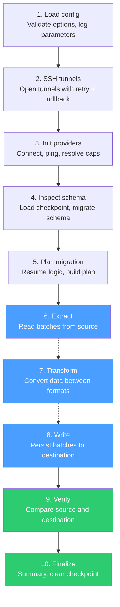
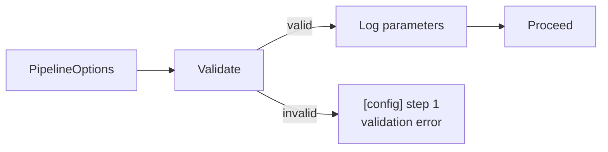
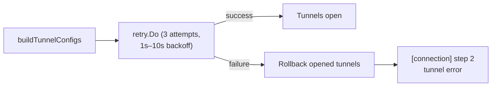
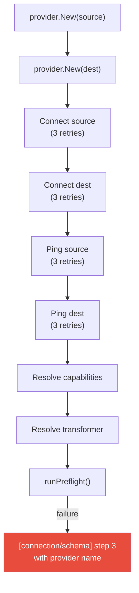
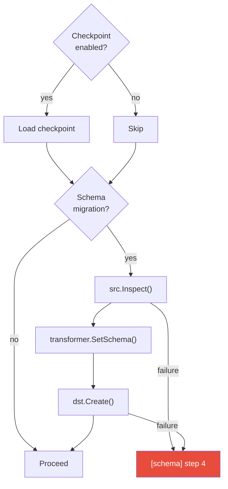
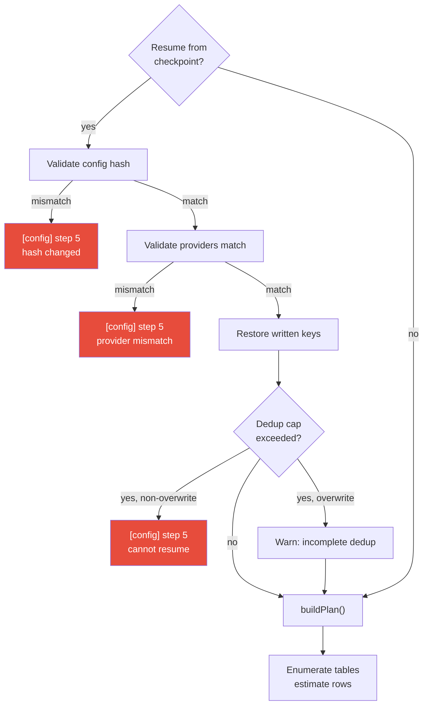
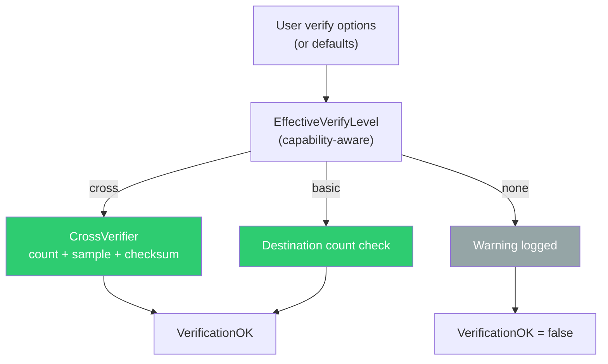
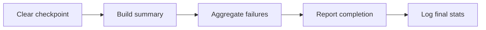

# Execution Steps

The pipeline runs a fixed 10-step sequence. Each step has a single responsibility and clear entry/exit points. Steps are sequential except for 6–8, which overlap in a streaming pipeline.

## Step-by-step flow

## Step details

### Step 1: Load config

- Validates batch size, retry count, worker count, conflict strategy
- Logs source/dest providers, cross-DB flag, dry-run mode
- No I/O, no connections

### Step 2: SSH tunnels

- Opens SSH tunnels for source and/or destination if configured
- On failure, already-opened tunnels are closed (rollback)
- 3 retry attempts with exponential backoff

### Step 3: Init providers

- Creates provider instances from the registry
- Connects with 3 retries per side (1s–10s backoff)
- Pings to verify liveness
- Resolves capabilities (schema support, verification level, transactions)
- Resolves transformer for the provider pair
- Runs preflight checks (transformer availability, schema caps, FK handling)

### Step 4: Inspect schema

### Step 5: Plan migration

### Steps 6–8: Transfer

See [Concurrency Model](concurrency.md) for the detailed goroutine layout. Key behaviors:

- **Scan retry**: `maxRetries+1` attempts, 500ms–10s backoff
- **Transform retry**: same as scan. On failure: skip batch (default) or abort (`--fail-fast`)
- **Write retry**: `maxRetries+1` attempts, 500ms–30s backoff
- **Dedup**: per-batch key filtering against `writtenKeySet`
- **Checkpoint**: throttled by `--checkpoint-interval`

### Step 9: Verify

- Verification failures are **non-fatal** — logged and stored in summary
- `VerifiedAny` tracks whether any real checks ran (prevents false "passed")

### Step 10: Finalize

## Error categorization by step

| Step | Possible error categories          |
| ---- | ---------------------------------- |
| 1    | `config`                           |
| 2    | `connection`                       |
| 3    | `connection`, `schema` (preflight) |
| 4    | `schema`                           |
| 5    | `config`                           |
| 6    | `scan` (per-batch, non-fatal)      |
| 7    | `transform` (per-batch, non-fatal) |
| 8    | `write` (per-batch), `cancelled`   |
| 9    | `verify` (non-fatal)               |
| 10   | none                               |
