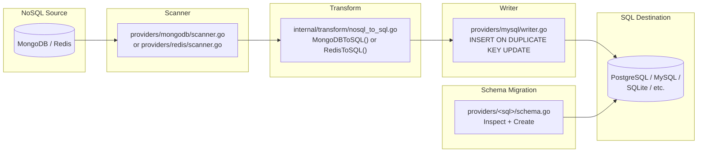

# NoSQL to SQL Migration Flow

This document explains how data moves from a NoSQL source (MongoDB, Redis) to a SQL destination (PostgreSQL, MySQL, MariaDB, CockroachDB, MSSQL, SQLite), including how documents and keys are mapped into relational tables and what limitations apply.

## Overview



## Step 1: NoSQL Scanning

### MongoDB Scanner

**File: `providers/mongodb/scanner.go:21-233`**

The MongoDB scanner iterates over all collections in a database using cursor-based reads:

```go
// providers/mongodb/scanner.go:67-146 (simplified)
func (s *mongoDBScanner) Next(ctx context.Context) ([]provider.MigrationUnit, error) {
    // First call: list all collections
    if s.collections == nil {
        s.listCollections(ctx)
        // Filter out completed collections on resume
    }

    for len(units) < batchSize && !s.done {
        if s.cursor != nil && s.cursor.Next(ctx) {
            unit, _ := s.readDocument(s.collections[s.currentColl], s.cursor)
            units = append(units, *unit)
            s.stats.TotalScanned++
            continue
        }

        // Cursor exhausted — move to next collection
        s.cursor.Close(ctx)
        s.cursor = nil
        s.currentColl++
        s.stats.TablesDone++

        // Open new cursor for next collection
        cursor, _ := s.database.Collection(collName).Find(ctx, bson.M{}, findOpts)
        s.cursor = cursor
    }
}
```

Each document is read as raw BSON (`cursor.Current`) and wrapped in a MongoDB envelope:

```go
// providers/mongodb/scanner.go:199-233
func (s *mongoDBScanner) readDocument(collection string, cursor *mongo.Cursor) (*provider.MigrationUnit, error) {
    rawBytes := cursor.Current
    docID, _ := extractDocumentID(rawBytes)

    doc := &mongoDocument{
        Collection: collection,
        DocumentID: docID,
        Data:       rawBytes,
    }
    data, _ := encodeMongoDocument(doc) // JSON envelope

    return &provider.MigrationUnit{
        Key:      collection + ":" + formatDocumentID(docID),
        Table:    collection,
        DataType: provider.DataTypeDocument,
        Data:     data,
        Size:     int64(len(rawBytes)),
    }, nil
}
```

### Redis Scanner

**File: `providers/redis/scanner.go:19-491`**

The Redis scanner uses `SCAN` to enumerate keys, then reads each key's type, value, and TTL:

```go
// providers/redis/scanner.go:57-119 (simplified)
func (s *redisScanner) Next(ctx context.Context) ([]provider.MigrationUnit, error) {
    // SCAN for next batch of keys
    keys, nextCursor := s.client.Scan(ctx, s.cursor, match, scanCount).Val()

    for _, key := range keys {
        if _, skip := s.processed[key]; skip { continue } // resume dedup
        unit, _ := s.readKey(ctx, key)
        units = append(units, *unit)
        s.processed[key] = struct{}{}
    }
    s.cursor = nextCursor
}
```

`readKey` (`providers/redis/scanner.go:129-228`) dispatches by Redis type:

- `string` → `GET`
- `hash` → `HGETALL` (or `HSCAN` for large hashes, chunk size 500)
- `list` → `LRANGE` (paginated, chunk size 500)
- `set` → `SMEMBERS` (or `SSCAN`, chunk size 500)
- `zset` → `ZRANGE` with scores (or `ZSCAN`, chunk size 500)
- `stream` → `XRANGE` (paginated, chunk size 100)

Each key becomes a MigrationUnit with a JSON envelope:

```json
{
  "type": "hash",
  "value": { "user_id": "42", "expires": "1700000000" },
  "ttl_seconds": 3600
}
```

## Step 2: Transformation — NoSQL to SQL envelope

**File: `internal/transform/nosql_to_sql.go`**

### MongoDB to SQL

`MongoDBToSQL()` (`internal/transform/nosql_to_sql.go:96-167`) converts document envelopes into SQL row envelopes:

```go
func MongoDBToSQL(units []provider.MigrationUnit, envCfg SQLEnvelopeConfig, cfg *TransformerConfig) ([]provider.MigrationUnit, error) {
    for _, unit := range units {
        var envelope map[string]any
        sonic.Unmarshal(unit.Data, &envelope)

        doc := envelope["document"].(map[string]any)
        collection := envelope["collection"].(string)

        // Apply null handler and field mappings
        if cfg.NullHandler != nil { doc, _ = cfg.NullHandler.Apply(doc) }
        if cfg.FieldMapping != nil { doc, _ = cfg.FieldMapping.Apply(collection, doc) }

        // Flatten complex types to JSON strings, all columns become TEXT
        data := make(map[string]any)
        columnTypes := make(map[string]string)
        for k, v := range doc {
            switch val := v.(type) {
            case map[string]any, []any:
                b, _ := sonic.Marshal(val)
                data[k] = string(b) // nested objects/arrays → JSON strings
            default:
                data[k] = v
            }
            columnTypes[k] = "TEXT"
        }

        pk := map[string]any{"_id": unit.Key}
        sqlEnvelope := map[string]any{
            "table": collection, "primary_key": pk,
            "data": data, "column_types": columnTypes,
        }
        if envCfg.SchemaName != "" {
            sqlEnvelope["schema"] = envCfg.SchemaName
        }
    }
}
```

### Redis to SQL

`RedisToSQL()` (`internal/transform/nosql_to_sql.go:22-92`) converts Redis key envelopes into SQL row envelopes:

```go
func RedisToSQL(units []provider.MigrationUnit, envCfg SQLEnvelopeConfig, cfg *TransformerConfig) ([]provider.MigrationUnit, error) {
    for _, unit := range units {
        // Decode Redis envelope
        var rd struct {
            Type       string `json:"type"`
            Value      any    `json:"value"`
            TTLSeconds int64  `json:"ttl_seconds"`
        }
        sonic.Unmarshal(unit.Data, &rd)

        // For non-hash types, wrap the value
        fields, ok := rd.Value.(map[string]any)
        if !ok {
            b, _ := sonic.Marshal(map[string]any{"value": rd.Value})
            fields = map[string]any{"value": string(b)}
        }

        // All columns become TEXT
        data := make(map[string]any)
        columnTypes := make(map[string]string)
        for k, v := range fields {
            data[k] = v
            columnTypes[k] = "TEXT"
        }
        data["_key"] = unit.Key          // add original Redis key as column
        columnTypes["_key"] = "TEXT"

        pk := map[string]any{"_key": unit.Key}
        sqlEnvelope := map[string]any{
            "table": table, "primary_key": pk,
            "data": data, "column_types": columnTypes,
        }
    }
}
```

## Step 3: Schema Migration

Before data transfer, the pipeline runs schema migration if both providers support it. The destination schema is inferred from the source data rather than declared explicitly.

**File: `internal/bridge/pipeline.go:1084-1131`**

```go
func (p *Pipeline) migrateSchema(ctx context.Context) error {
    srcMigrator := p.src.SchemaMigrator(ctx)
    schema, _ := srcMigrator.Inspect(ctx)

    // Pass schema to transformer for type mapping
    if p.transformer.NeedsSchema() {
        p.transformer.SetSchema(schema)
    }

    dstMigrator := p.dst.SchemaMigrator(ctx)
    var mapper provider.TypeMapper
    if p.config.IsCrossDB() {
        if tm, ok := p.transformer.(transform.TypeMapperProvider); ok {
            mapper = tm.TypeMapper()
        }
    }
    dstMigrator.Create(ctx, schema, mapper)
}
```

For NoSQL→SQL migrations, schema support depends on the source:

- **MongoDB** has `Schema: true` (for index migration) but does not have DDL schemas. The scanner produces collections that map to tables.
- **Redis** has `Schema: false` — schema migration is skipped entirely.

The schema migrator for SQL destinations creates tables with all `TEXT` columns since NoSQL sources do not carry type information.

## Step 4: Writing to SQL destination

**File: `providers/mysql/writer.go`** (representative for all SQL writers)

The SQL writer groups rows by table and uses batch INSERT:

```go
// providers/mysql/writer.go:47-93
func (w *mysqlWriter) Write(ctx context.Context, units []provider.MigrationUnit) (*provider.BatchResult, error) {
    // Group rows by table
    tableRows := make(map[string][]mysqlRow)
    for _, unit := range units {
        row, _ := decodeMySQLRow(unit.Data)
        tableRows[row.Table] = append(tableRows[row.Table], *row)
    }

    // Write each table's rows
    for table, rows := range tableRows {
        w.writeTable(ctx, table, rows, &failedKeys, &errors)
    }
}
```

For **overwrite** mode, MySQL uses chunked `INSERT ... ON DUPLICATE KEY UPDATE`:

```go
// providers/mysql/writer.go:125-167
query := "INSERT INTO `users` (`_id`, `name`, `email`) VALUES (?, ?, ?) AS new ON DUPLICATE KEY UPDATE ..."
```

Chunking is based on `max_allowed_packet` (16 MiB default, `providers/mysql/writer.go:28`).

## Mapping rules and limitations

### MongoDB to SQL

| MongoDB Concept   | SQL Destination          | Limitation                             |
| ----------------- | ------------------------ | -------------------------------------- |
| Collection        | Table                    | Direct name mapping                    |
| Document          | Row                      | Each document becomes one row          |
| `_id` field       | `_id` column (TEXT)      | Loses ObjectId type — becomes string   |
| Nested object     | JSON-encoded TEXT column | Not queryable as structured data       |
| Array field       | JSON-encoded TEXT column | Not queryable as structured data       |
| Mixed-type field  | TEXT column              | Type information lost                  |
| Index definitions | Not migrated             | Schema migrator only handles table DDL |
| TTL indexes       | Not preserved            | No TTL concept in SQL                  |

### Redis to SQL

| Redis Concept | SQL Destination             | Limitation                                 |
| ------------- | --------------------------- | ------------------------------------------ |
| Key name      | `_key` column               | All keys go into one table unless prefixed |
| Hash fields   | Table columns (all TEXT)    | No type preservation                       |
| String values | `value` column (TEXT)       | Wrapped in a JSON object                   |
| Lists         | JSON-encoded TEXT column    | Not queryable as rows                      |
| Sets          | JSON-encoded TEXT column    | Not queryable as rows                      |
| Sorted sets   | JSON-encoded TEXT column    | Score information serialized               |
| Streams       | JSON-encoded TEXT column    | Entry IDs and fields serialized            |
| TTL           | Dropped                     | No TTL concept in SQL                      |
| Key patterns  | Single table (`redis_data`) | No automatic table sharding by key prefix  |

### General limitations

1. **Type loss**: All NoSQL values become `TEXT` columns. The transformer has no type metadata to produce `INTEGER`, `TIMESTAMP`, etc.
2. **Nested data**: MongoDB nested documents and arrays are JSON-serialized into TEXT columns — they cannot be queried with SQL predicates.
3. **Schema inference**: The destination schema is created from source metadata, not from inspecting actual data values. For NoSQL sources this means all TEXT.
4. **Single Redis table**: By default, all Redis keys are placed in a single `redis_data` table. The `envCfg.DefaultTableName` can override this but there is no automatic key-prefix-to-table mapping.
5. **No reverse transformation guarantees**: Migrating SQL → NoSQL → SQL will not produce the original schema due to type loss at each hop.

## Files involved

| File                                    | Role                                                     |
| --------------------------------------- | -------------------------------------------------------- |
| `providers/mongodb/scanner.go`          | MongoDB document scanning, cursor-based reads            |
| `providers/redis/scanner.go`            | Redis key scanning, type-aware reads, chunked reads      |
| `internal/transform/nosql_to_sql.go`    | `RedisToSQL()` and `MongoDBToSQL()` conversion functions |
| `internal/transform/null_handler.go`    | Null policy application                                  |
| `internal/transform/field_mapping.go`   | Field rename/drop/convert rules                          |
| `providers/mysql/writer.go`             | MySQL batch INSERT with upsert                           |
| `providers/postgres/writer.go`          | PostgreSQL batch INSERT                                  |
| `providers/sqlite/writer.go`            | SQLite batch INSERT                                      |
| `providers/<sql>/schema.go`             | Schema inspection (Inspect) and creation (Create)        |
| `internal/bridge/pipeline.go:1084-1131` | Schema migration orchestration                           |
| `providers/mongodb/types.go`            | `mongoDocument` struct, encode/decode helpers            |
| `providers/redis/types.go`              | `redisKeyData` struct, encode/decode helpers             |
