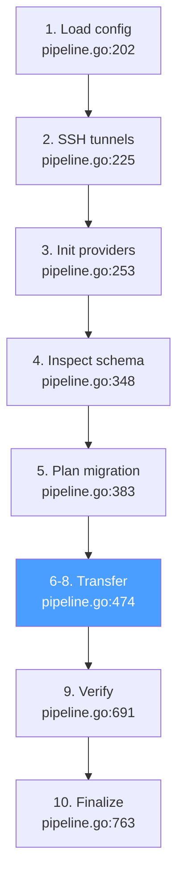

# Core Migration Pipeline

The migration pipeline is a 10-step sequential process orchestrated by `Pipeline.Run()` in `internal/bridge/pipeline.go:129-195`. Steps 6–8 run concurrently via a producer-consumer design.



## Step 1: Load config

**File: `internal/bridge/pipeline.go:202-222`**

Validates `PipelineOptions` and logs the migration configuration.

```go
func (p *Pipeline) stepLoadConfig(result *RunResult) error {
    p.reporter.OnPhaseChange(provider.PhaseInit)
    if err := p.opts.Validate(); err != nil {
        return NewConfigError(1, "pipeline options", err)
    }
    // Logs: source, destination, cross_db flag, dry_run
}
```

**Validation** (`internal/bridge/options.go:107-142`): checks `BatchSize > 0`, `Parallel >= 1`, `WriteWorkers >= 1`, `ConflictStrategy` is one of `overwrite/skip/error`, `FKHandling` is one of `defer_constraints/ordered/skip`.

## Step 2: SSH tunnels

**File: `internal/bridge/pipeline.go:225-249`**

Establishes SSH tunnels if configured. Uses retry with 3 attempts, exponential backoff.

```go
func (p *Pipeline) stepValidate(ctx context.Context, result *RunResult) error {
    tunnelConfigs := p.buildTunnelConfigs() // from source/destination SSH config
    retry.Do(ctx, tunnelRetry, func() error {
        return p.tunnels.OpenAll(ctx, tunnelConfigs)
    })
    defer func() { _ = p.tunnels.CloseAll() }()
}
```

**Files involved**:

- `internal/tunnel/ssh.go` — SSH tunnel implementation
- `internal/tunnel/pool.go` — manages multiple tunnels by name ("source"/"destination")

## Step 3: Init providers

**File: `internal/bridge/pipeline.go:253-344`**

Creates, connects, and pings source and destination providers. Resolves capabilities and transformer.

```go
func (p *Pipeline) stepInitProviders(ctx context.Context, result *RunResult) error {
    // Create providers via registry
    p.src, _ = provider.New(p.config.Source.Provider)   // e.g. "mysql"
    p.dst, _ = provider.New(p.config.Destination.Provider) // e.g. "mongodb"

    // Resolve tunnel addresses (local port → remote host:port)
    srcConfig := p.resolveProviderConfig("source", &p.config.Source)
    dstConfig := p.resolveProviderConfig("destination", &p.config.Destination)

    // Connect with retry (3 attempts, exponential backoff)
    retry.Do(ctx, connectRetry, func() error {
        return p.src.Connect(ctx, srcConfig, nil)
    })
    retry.Do(ctx, connectRetry, func() error {
        return p.dst.Connect(ctx, nil, dstConfig)
    })

    // Ping both
    retry.Do(ctx, connectRetry, func() error { return p.src.Ping(ctx) })
    retry.Do(ctx, connectRetry, func() error { return p.dst.Ping(ctx) })

    // Resolve capabilities
    p.srcCaps = provider.ProviderCapabilities(p.src)
    p.dstCaps = provider.ProviderCapabilities(p.dst)

    // Dry-run wrapping
    if p.opts.DryRun { p.dst = p.dst.DryRun() }

    // Resolve transformer
    transform.SetGlobalConfig(p.buildTransformerConfig())
    p.transformer = transform.GetTransformer(src, dst)

    // Preflight validation
    p.runPreflight(ctx)
}
```

**Provider resolution**: `provider.New()` (`pkg/provider/factory.go:27-36`) looks up the provider name in a global registry. Each provider registers itself via `init()`:

```
cmd/bridge/provider_mysql.go    → provider.Register("mysql", ...)
cmd/bridge/provider_postgres.go → provider.Register("postgres", ...)
cmd/bridge/provider_mongodb.go  → provider.Register("mongodb", ...)
cmd/bridge/provider_redis.go    → provider.Register("redis", ...)
... etc
```

**Preflight checks** (`internal/bridge/preflight.go:17-51`):

1. Transformer availability for cross-engine pairs
2. `--migrate-schema` vs provider schema capability
3. `--fk-handling` vs destination transaction support
4. Verification level compatibility
5. Source schema validation (tables exist)

## Step 4: Inspect schema/metadata

**File: `internal/bridge/pipeline.go:348-379`**

Loads checkpoint and migrates DDL schema if supported.

```go
func (p *Pipeline) stepInspect(ctx context.Context, result *RunResult, ms *migrationState) error {
    // Load checkpoint (if enabled)
    if p.opts.CheckpointEnabled {
        ms.checkpoint, _ = p.checkpoint.Load(ctx)
    }

    // Schema migration (if both providers support it)
    if p.shouldMigrateSchema() {
        p.migrateSchema(ctx)
    }
}
```

### Schema migration

**File: `internal/bridge/pipeline.go:1084-1131`**

```go
func (p *Pipeline) migrateSchema(ctx context.Context) error {
    // 1. Inspect source schema
    srcMigrator := p.src.SchemaMigrator(ctx)
    schema, _ := srcMigrator.Inspect(ctx)
    // schema.Tables → []TableSchema with Columns and Indexes

    // 2. Pass schema to transformer for type mapping
    if p.transformer.NeedsSchema() {
        p.transformer.SetSchema(schema)
    }

    // 3. Get type mapper from transformer (cross-DB only)
    var mapper provider.TypeMapper
    if p.config.IsCrossDB() {
        if tm, ok := p.transformer.(transform.TypeMapperProvider); ok {
            mapper = tm.TypeMapper()
        }
    }

    // 4. Create schema on destination
    dstMigrator := p.dst.SchemaMigrator(ctx)
    dstMigrator.Create(ctx, schema, mapper)
}
```

Each SQL provider implements `SchemaMigrator` in `providers/<sql>/schema.go`. The `Inspect` method queries `information_schema` (or equivalent) to get tables, columns, and indexes. The `Create` method generates DDL statements, optionally applying type mapping.

## Step 5: Plan migration

**File: `internal/bridge/pipeline.go:383-462`**

Handles resume logic, builds a structured `MigrationPlan`, restores dedup state, and prepares the batch start ID.

```go
func (p *Pipeline) stepPlan(ctx context.Context, result *RunResult, ms *migrationState) error {
    // Resume from checkpoint
    if ms.checkpoint != nil && p.opts.Resume {
        // Validate config hash hasn't changed
        currentHash := computeConfigHash(p.config)
        if ms.checkpoint.ConfigHash != currentHash { return error }

        // Validate provider names match
        if ms.checkpoint.SourceProvider != p.config.Source.Provider { return error }

        // Restore written keys for dedup
        for _, k := range ms.checkpoint.WrittenKeys {
            p.writtenKeySet[k] = true
        }
        result.Resumed = true
    }

    ms.startBatchID = lastBatchID(ms.checkpoint)

    // Build migration plan
    plan := p.buildPlan(ctx)
    result.Plan = plan
    logPlan(plan)
}
```

### Migration plan

**File: `internal/bridge/plan.go:113-133`**

```go
func (p *Pipeline) buildPlan(ctx context.Context) *MigrationPlan {
    plan := &MigrationPlan{
        SourceProvider:  p.config.Source.Provider,
        DestProvider:    p.config.Destination.Provider,
        CrossDB:         p.config.IsCrossDB(),
        SchemaMigration: p.shouldMigrateSchema(),
        TransformerType: transformerName(p.transformer),
        Verification:    string(provider.EffectiveVerifyLevel(p.srcCaps, p.dstCaps)),
    }
    p.planTables(ctx, plan)        // enumerate tables + row estimates
    p.planTypeMappings(ctx, plan)  // resolve column type conversions
    p.planFieldMappings(plan)      // summarize user field mapping rules
    p.planWarnings(plan)           // non-fatal issues
    return plan
}
```

`planTables` (`internal/bridge/plan.go:136-167`) tries `TableEnumerator` first (fastest), then falls back to `SchemaMigrator.Inspect`.

`planTypeMappings` (`internal/bridge/plan.go:171-233`) uses the transformer's `TypeMapper` to resolve source→destination type conversions and flags lossy conversions (e.g. `TIMESTAMPTZ → TIMESTAMP` loses timezone).

## Steps 6–8: Transfer data

**File: `internal/bridge/pipeline.go:474-687`**

Steps 6 (extract), 7 (transform), and 8 (write) run concurrently in a producer-consumer pipeline. See [Concurrency Model](concurrency.md) for the detailed goroutine design.

```go
func (p *Pipeline) stepTransfer(ctx context.Context, result *RunResult, ms *migrationState) error {
    scanOpts := provider.ScanOptions{
        BatchSize:       p.opts.BatchSize,
        ResumeToken:     resumeToken(ms.checkpoint),
        TablesCompleted: tablesCompleted(ms.checkpoint),
    }
    scanner := p.src.Scanner(ctx, scanOpts)

    scanCh := make(chan scanResult, p.opts.Parallel)

    // Scanner goroutine (steps 6 + 7)
    go func() {
        defer close(scanCh)
        for {
            units, err := scanner.Next(ctx)  // Step 6: Extract
            if err == io.EOF { return }

            // Step 7: Transform (if cross-DB)
            if !transform.IsNoopTransformer(p.transformer) {
                units, err = p.transformer.Transform(ctx, units)
            }

            // Split by byte budget
            for _, sub := range splitBatch(units, p.opts.MaxBatchBytes) {
                scanCh <- scanResult{batchID: batchID, units: sub}
            }
        }
    }()

    // Writer goroutines (step 8)
    for i := 0; i < numWorkers; i++ {
        go func(bw *batchWriter) {
            for sr := range scanCh {
                out := bw.writeBatch(ctx, p, sr.units)
                // Track keys, checkpoint, report metrics
            }
        }(batchWriters[i])
    }

    scanWg.Wait()
    writeWg.Wait()
    // Flush all writers, save final checkpoint on cancellation
}
```

### batchWriter

**File: `internal/bridge/batch_writer.go:60-112`**

Each writer goroutine gets its own `batchWriter` that handles:

1. **Dedup** (`filterWritten`, line 175-188): filters out keys already written in this run (from checkpoint restore or prior batches).
2. **Batch write with retry** (line 78-95): calls `w.Write(ctx, deduped)` with exponential backoff.
3. **Partial failure recovery** (`retryIndividual`, line 114-162): if `Write()` succeeded but some keys failed, retries those units one at a time.
4. **Metrics recording** (`processWriteOutcome`, line 212-265): records written/failed/skipped counts, tracks keys, reports errors.

## Step 9: Verify

**File: `internal/bridge/pipeline.go:691-759`**

Compares source and destination data using capability-aware verification.

```go
func (p *Pipeline) stepVerify(ctx context.Context, result *RunResult, ms *migrationState) {
    effectiveLevel := provider.EffectiveVerifyLevel(p.srcCaps, p.dstCaps)

    switch effectiveLevel {
    case provider.VerifyCross:
        // Full cross-database verification: count + sample + checksum
        cv := verify.NewCrossVerifier(p.src, p.dst, verifyOpts)
        report, _ := cv.Verify(ctx)
        result.VerificationReport = report

    case provider.VerifyBasic:
        // Destination-only count check
        verifier := p.dst.Verifier(ctx)
        verifierErrors, _ := verifier.Verify(ctx, p.writtenKeysFlat())

    default:
        // Verification not supported
    }
}
```

**Verification levels** (`pkg/provider/capabilities.go:39-49`):

- `VerifyCross` — both sides implement `TableEnumerator`, `VerifyReader`, `Checksummer`. Full count + sampling + checksum comparison.
- `VerifyBasic` — destination-only count check via `Verifier` interface.
- `VerifyNone` — neither side supports verification.

**Cross-verification** (`internal/verify/`):

- `comparator.go` — field-by-field record comparison with type coercion
- `types.go` — `VerificationReport`, `TableResult`, `MismatchDetail` structs

## Step 10: Finalize

**File: `internal/bridge/pipeline.go:763-813`**

Builds the migration summary, records failures, clears the checkpoint, and reports completion.

```go
func (p *Pipeline) stepFinalize(ctx context.Context, result *RunResult, ms *migrationState) {
    _ = p.checkpoint.Clear(ctx)  // Delete checkpoint file

    ms.summary.EndTime = time.Now()
    ms.summary.Duration = ms.summary.EndTime.Sub(ms.summary.StartTime)
    p.metrics.ToSummary(ms.summary)
    ms.summary.Errors = ms.allErrors

    for _, e := range ms.allErrors {
        result.Failures.Record(e) // categorize errors
    }

    result.Summary = ms.summary
    p.reporter.OnMigrationComplete(ms.summary)
}
```

The `FailureSummary` (`internal/bridge/errors.go:253-278`) aggregates errors by category (config, connection, schema, scan, transform, write, verify, cancelled, internal).

## Error categorization

**File: `internal/bridge/errors.go:14-81`**

Every pipeline error is wrapped in a `CategorizedError` with category, step, phase, message, and retry policy:

| Category     | Retry | Max Attempts | Description              |
| ------------ | ----- | ------------ | ------------------------ |
| `config`     | No    | 1            | Invalid config/flags     |
| `connection` | Yes   | 3            | Network/auth failures    |
| `schema`     | Yes   | 2            | DDL migration failures   |
| `scan`       | Yes   | 3            | Source read failures     |
| `transform`  | No    | 1            | Data conversion failures |
| `write`      | Yes   | 5            | Destination write errors |
| `verify`     | No    | 1            | Verification mismatches  |
| `cancelled`  | No    | 0            | User interrupt           |

## Lifecycle controls

**File: `internal/bridge/pipeline.go:819-848`**

```go
// Pause suspends at the next batch boundary
func (p *Pipeline) Pause() {
    p.paused.Store(true)
}

// Resume resumes a paused pipeline
func (p *Pipeline) Resume() {
    p.paused.Store(false)
    p.pauseCond.Broadcast()
}

// Cancel cancels the context
func (p *Pipeline) Cancel() {
    p.cancelFn()
}
```

Writer goroutines check `waitIfPaused()` at each batch boundary (line 839-848), blocking on a condition variable. On cancel, the pipeline saves a final checkpoint before returning.

## Files involved

| File                              | Step(s) | Role                                                 |
| --------------------------------- | ------- | ---------------------------------------------------- |
| `internal/bridge/pipeline.go`     | 1–10    | Full pipeline orchestration                          |
| `internal/bridge/options.go`      | 1       | PipelineOptions defaults + validation                |
| `internal/bridge/plan.go`         | 5       | Migration plan building                              |
| `internal/bridge/preflight.go`    | 3       | Pre-migration validation checks                      |
| `internal/bridge/batch_writer.go` | 6–8     | Dedup, write, retry, metrics                         |
| `internal/bridge/checkpoint.go`   | 4, 5, 8 | Checkpoint load/save/clear                           |
| `internal/bridge/errors.go`       | All     | Error categorization + retry policies                |
| `internal/bridge/result.go`       | All     | RunResult and PhaseResult types                      |
| `internal/config/config.go`       | 1       | MigrationConfig, Resolve, Validate                   |
| `internal/config/loader.go`       | 1       | YAML/JSON config file loading                        |
| `internal/transform/transform.go` | 7       | Transformer interface                                |
| `internal/transform/registry.go`  | 7       | Transformer lookup by pair                           |
| `internal/verify/comparator.go`   | 9       | Record comparison logic                              |
| `internal/verify/types.go`        | 9       | Verification report types                            |
| `internal/tunnel/ssh.go`          | 2       | SSH tunnel implementation                            |
| `internal/tunnel/pool.go`         | 2       | Tunnel pool management                               |
| `internal/retry/retry.go`         | All     | Exponential backoff retry, `ConnectionRetryConfig()` |
| `internal/progress/reporter.go`   | All     | Metrics collection + TUI reporting                   |
