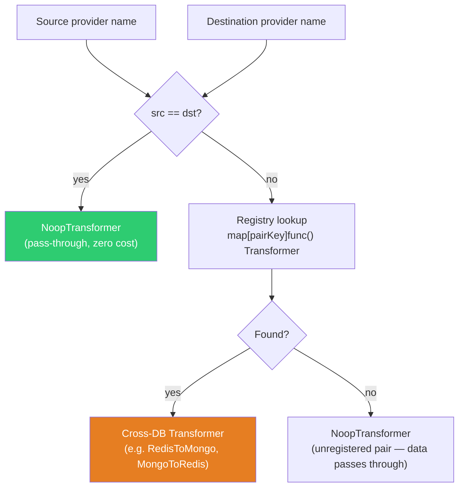

# Transformation Layer

The transformation layer converts data between provider formats when the source and destination use different database engines. It is responsible for translating SQL row envelopes into MongoDB document envelopes, Redis hash envelopes, or between SQL dialects with different type systems.

## Transformer registry

**File: `internal/transform/registry.go`**

Transformers are registered per source→destination pair using `init()` functions:

```go
// internal/transform/registry.go:9-17
type pairKey struct {
    src string
    dst string
}

var reg = make(map[pairKey]func() Transformer)
```

### Registration

Each transformer registers itself at init time:

```go
// internal/transform/redis_to_mongo.go:12-16
func init() {
    RegisterTransformer("redis", "mongodb", func() Transformer {
        return &RedisToMongoDBTransformer{}
    })
}

// internal/transform/mongo_to_redis.go:12-16
func init() {
    RegisterTransformer("mongodb", "redis", func() Transformer {
        return &MongoToRedisTransformer{}
    })
}
```

### Lookup

When the pipeline needs a transformer, it calls `GetTransformer(srcProvider, dstProvider)`:

```go
// internal/transform/registry.go:35-48
func GetTransformer(srcProvider, dstProvider string) Transformer {
    regMu.RLock()
    ctor, ok := reg[pairKey{src: srcProvider, dst: dstProvider}]
    regMu.RUnlock()

    if !ok {
        return NoopTransformer{} // passthrough for same-engine or unregistered pairs
    }
    t := ctor()
    if ct, ok := t.(ConfigurableTransformer); ok {
        ct.Configure(globalConfig) // inject null handler, field mappings, dialects
    }
    return t
}
```

### Resolution flow



## Transformer interface

**File: `internal/transform/transform.go`**

```go
type Transformer interface {
    Transform(ctx context.Context, units []provider.MigrationUnit) ([]provider.MigrationUnit, error)
    NeedsSchema() bool
    SetSchema(schema *provider.Schema)
}
```

- `Transform` — takes a batch of source-format units and returns destination-format units. May change `DataType`, restructure the `Data` envelope, and update `Key`/`Table`/`Size`.
- `NeedsSchema` — returns true if the transformer needs source schema information (e.g. for type mapping). If true, the pipeline calls `SetSchema` before data transfer.
- `SetSchema` — provides the inspected source schema for transformers that need column type info.

### Optional interfaces

```go
// ConfigurableTransformer — receives runtime config (null policy, field mappings)
type ConfigurableTransformer interface {
    Transformer
    Configure(cfg TransformerConfig)
}

// TypeMapperProvider — provides type mapping for schema migration
type TypeMapperProvider interface {
    Transformer
    TypeMapper() provider.TypeMapper
}
```

## Registered transformer pairs

| Source    | Destination | Transformer                 | File                                   | NeedsSchema |
| --------- | ----------- | --------------------------- | -------------------------------------- | ----------- |
| `redis`   | `mongodb`   | `RedisToMongoDBTransformer` | `internal/transform/redis_to_mongo.go` | No          |
| `mongodb` | `redis`     | `MongoToRedisTransformer`   | `internal/transform/mongo_to_redis.go` | No          |

All other cross-engine pairs (SQL→MongoDB, SQL→Redis, MongoDB→SQL, Redis→SQL, SQL→SQL) currently resolve to `NoopTransformer` and use the shared conversion functions (`SQLToMongoDB`, `SQLToRedis`, `MongoDBToSQL`, `RedisToSQL`) called directly by per-provider transformers or via the `BuildSQLToSQLStages` pipeline.

## TransformerConfig

**File: `internal/transform/transformer_config.go`**

```go
type TransformerConfig struct {
    NullHandler  *NullHandler
    FieldMapping *FieldMappingApplier
    SrcDialect   Dialect
    DstDialect   Dialect
}
```

The pipeline builds this config in `internal/bridge/pipeline.go:1293-1308`:

```go
func (p *Pipeline) buildTransformerConfig() transform.TransformerConfig {
    tc := transform.TransformerConfig{
        SrcDialect: transform.Dialect(p.config.Source.Provider),
        DstDialect: transform.Dialect(p.config.Destination.Provider),
    }
    tc.NullHandler = &transform.NullHandler{
        Policy: transform.NullPolicyFromString(p.config.Transform.NullPolicy),
    }
    if len(p.config.Transform.Mappings) > 0 {
        tc.FieldMapping = transform.NewFieldMappingApplier(p.config.Transform.Mappings)
    }
    return tc
}
```

Set as global config before transformer creation:

```go
transform.SetGlobalConfig(p.buildTransformerConfig())
p.transformer = transform.GetTransformer(src, dst)
```

## Null handling

**File: `internal/transform/null_handler.go`**

Controls how NULL/nil values are handled during transformation:

```go
type NullPolicy int

const (
    NullPassThrough NullPolicy = iota // silently copy nulls (default)
    NullDrop                          // remove key-value pairs where value is nil
    NullReplace                       // substitute nil with ""
    NullError                         // return error if any nil value found
)
```

Applied by all conversion functions before field mapping:

```go
// internal/transform/null_handler.go:33-48
func (h *NullHandler) Apply(data map[string]any) (map[string]any, error) {
    switch h.Policy {
    case NullDrop:
        result := make(map[string]any, len(data))
        for k, v := range data {
            if v != nil { result[k] = v }
        }
        return result, nil
    case NullReplace:
        result := make(map[string]any, len(data))
        for k, v := range data {
            if v == nil { result[k] = "" } else { result[k] = v }
        }
        return result, nil
    case NullError:
        for k, v := range data {
            if v == nil { return data, fmt.Errorf("null value found for key %q", k) }
        }
    }
    return data, nil
}
```

Configured via `transform.null_policy` in the config file: `"passthrough"`, `"drop"`, `"replace"`, or `"error"`.

## Field mapping

**File: `internal/transform/field_mapping.go`**

User-defined rules for renaming, dropping, or converting fields during transformation:

```go
type FieldMapping struct {
    Source      string // Source field/column name
    Destination string // Target field name
    Action      string // "rename", "drop", or "convert"
    Convert     string // Type spec: "string", "int", "float", "bool", "timestamp:src:dst"
}
```

Applied after null handling:

```go
// internal/transform/field_mapping.go:38-96
func (a *FieldMappingApplier) Apply(table string, data map[string]any) (map[string]any, error) {
    rules := a.tableMappings[table]
    if len(rules) == 0 { rules = a.wildcardMappings } // fallback to "*" rules
    if len(rules) == 0 { return data, nil }

    result := copyMap(data)
    for _, m := range rules {
        switch m.Action {
        case "drop":
            delete(result, m.Source)
        case "rename":
            result[m.Destination] = result[m.Source]
            delete(result, m.Source)
        case "convert":
            result[dst] = applyConvert(result[m.Source], m.Convert)
        }
    }
    return result, nil
}
```

Type coercion via `applyConvert` (`internal/transform/field_mapping.go:100-129`):

- `"string"` → `fmt.Sprintf("%v", v)`
- `"int"` → `coerceInt(v)` — handles float64, string parsing
- `"float"` → `coerceFloat(v)`
- `"bool"` → `coerceBool(v)`
- `"timestamp:mysql:postgres"` → `ConvertTimestamp(s, srcDialect, dstDialect)`

## Type converter and timestamp handling

**File: `internal/transform/type_converter.go`**

Handles timestamp format conversion between SQL dialects:

```go
func TimestampFormats(d Dialect) (primary string, alternates []string) {
    switch d {
    case DialectMySQL, DialectMariaDB:
        return "2006-01-02 15:04:05", []string{time.RFC3339Nano}
    case DialectPostgres, DialectCockroachDB:
        return time.RFC3339Nano, []string{"2006-01-02 15:04:05"}
    case DialectMSSQL:
        return "2006-01-02T15:04:05.9999999Z07:00", []string{time.RFC3339Nano}
    case DialectSQLite:
        return time.RFC3339Nano, []string{"2006-01-02 15:04:05"}
    }
}
```

`ConvertTimestamp(value, srcDialect, dstDialect)` parses using source formats and reformats for destination:

```go
func ConvertTimestamp(value string, srcDialect, dstDialect Dialect) string {
    parsed, ok := parseTimestamp(value, srcDialect)
    if !ok { return value } // graceful degradation
    dstPrimary, _ := TimestampFormats(dstDialect)
    return parsed.Format(dstPrimary)
}
```

## SQL-to-SQL transformation stages

**File: `internal/transform/sql_to_sql.go`**

SQL-to-SQL migration uses a multi-stage pipeline built by `BuildSQLToSQLStages`:

```go
// internal/transform/sql_to_sql.go:137-162
func BuildSQLToSQLStages(src, dst string, schema *provider.Schema) []func([]provider.MigrationUnit) ([]provider.MigrationUnit, error) {
    var stages []func([]provider.MigrationUnit) ([]provider.MigrationUnit, error)

    // Stage 1: Timestamp conversion (if dialects differ)
    if NeedsTimestampConversion(src, dst) {
        stages = append(stages, func(units []provider.MigrationUnit) ([]provider.MigrationUnit, error) {
            return ConvertTimestampColumns(units, schema, Dialect(src), Dialect(dst))
        })
    }

    // Stage 2: Schema field adjustment
    needsSchema := NeedsSchemaField(dst) // postgres, cockroachdb
    hasSchema := NeedsSchemaField(src)
    if needsSchema && !hasSchema {
        stages = append(stages, func(units []provider.MigrationUnit) ([]provider.MigrationUnit, error) {
            return AdjustSchemaField(units, true, "public") // add "schema" field
        })
    } else if !needsSchema && hasSchema {
        stages = append(stages, func(units []provider.MigrationUnit) ([]provider.MigrationUnit, error) {
            return AdjustSchemaField(units, false, "") // remove "schema" field
        })
    }

    return stages
}
```

Dialects that share formats skip conversion:

- MySQL ↔ MariaDB: same datetime format, no conversion needed
- PostgreSQL ↔ CockroachDB: same timestamp format, no conversion needed

### AdjustSchemaField

**File: `internal/transform/sql_to_sql.go:13-39`**

Adds or removes the `"schema"` field in SQL row envelopes. Required when migrating between providers that use schema namespaces (PostgreSQL, CockroachDB) and those that don't (MySQL, SQLite):

```go
func AdjustSchemaField(units []provider.MigrationUnit, add bool, schemaName string) ([]provider.MigrationUnit, error) {
    for i, unit := range units {
        var envelope map[string]any
        sonic.Unmarshal(unit.Data, &envelope)

        if add {
            if _, ok := envelope["schema"]; !ok {
                envelope["schema"] = schemaName // e.g. "public"
            }
        } else {
            delete(envelope, "schema")
        }

        unit.Data, _ = sonic.Marshal(envelope)
        result[i] = unit
    }
}
```

## Redis-to-MongoDB transformation

**File: `internal/transform/redis_to_mongo.go`**

Handles all Redis data types and converts them into MongoDB documents:

```go
func (t *RedisToMongoDBTransformer) transformUnit(unit provider.MigrationUnit) []provider.MigrationUnit {
    // Decode Redis envelope
    var rd struct { Type string; Value any; TTLSeconds int64 }
    sonic.Unmarshal(unit.Data, &rd)

    // Derive collection from key prefix (before first ":")
    collection := collectionFromKey(unit.Key)

    switch rd.Type {
    case "hash":   return t.transformHash(key, collection, rd.Value, rd.TTLSeconds)
    case "string": return t.transformString(key, collection, rd.Value, rd.TTLSeconds)
    case "list":   return t.transformList(key, collection, rd.Value, rd.TTLSeconds)
    case "set":    return t.transformSet(key, collection, rd.Value, rd.TTLSeconds)
    case "zset":   return t.transformZSet(key, collection, rd.Value, rd.TTLSeconds)
    case "stream": return t.transformStream(key, collection, rd.Value, rd.TTLSeconds)
    }
}
```

Collection name derivation:

```go
func collectionFromKey(key string) string {
    parts := strings.SplitN(key, ":", 2)
    return parts[0] // "session:abc123" → "session"
}
```

Each type converts differently:

- `hash` → document with hash fields as document fields, `_id` = key
- `string` → if parseable JSON, use as document; otherwise `{_id, value, _ttl}`
- `list` → `{_id, items, _ttl}`
- `set` → `{_key, members, _ttl}`
- `zset` → `{_key, members, _ttl}`
- `stream` → one document per stream entry `{_stream, ...fields}`

## MongoDB-to-Redis transformation

**File: `internal/transform/mongo_to_redis.go`**

Converts MongoDB documents into Redis hashes:

```go
func (t *MongoToRedisTransformer) transformUnit(unit provider.MigrationUnit) (provider.MigrationUnit, error) {
    var envelope map[string]any
    sonic.Unmarshal(unit.Data, &envelope)
    doc := envelope["document"].(map[string]any)

    // Flatten complex types to strings
    fields := make(map[string]any)
    for k, v := range doc {
        switch val := v.(type) {
        case map[string]any, []any:
            b, _ := sonic.Marshal(val)
            fields[k] = string(b) // nested data → JSON string
        default:
            fields[k] = fmt.Sprintf("%v", val)
        }
    }

    // All MongoDB documents become Redis hashes
    redisEnvelope := map[string]any{
        "type": "hash", "value": fields, "ttl_seconds": 0,
    }
    data, _ := sonic.Marshal(redisEnvelope)

    return provider.MigrationUnit{
        Key: hashKey, Table: collection,
        DataType: provider.DataTypeHash,
        Data: data, Size: int64(len(data)),
    }, nil
}
```

## Lossy conversion detection

**File: `internal/bridge/plan.go:334-360`**

The planning stage detects potentially lossy type conversions:

```go
var lossyPairs = []struct{ src, dst string }{
    {"TIMESTAMPTZ", "TIMESTAMP"}, // timezone info lost
    {"TIMESTAMP", "DATE"},        // time component lost
    {"TEXT", "VARCHAR"},          // truncation risk
    {"BIGINT", "INT"},            // range reduction
    {"DOUBLE", "FLOAT"},          // precision loss
    {"DECIMAL", "FLOAT"},         // exact → approximate
    {"JSONB", "JSON"},            // query capability lost
    {"BYTEA", "BLOB"},            // encoding difference
}
```

These are surfaced in `MigrationPlan.UnsupportedFields` during planning.

## planTypeMappings function

**File:** `internal/bridge/plan.go:171-233`

During the plan phase (Step 5), the pipeline calls `planTypeMappings()` to build an advisory type mapping report. This function does **not** modify data — it only populates the `MigrationPlan` with type conversion information and warnings.

### How it works

1. **Early return** if not a cross-database migration (`!p.config.IsCrossDB()`).
2. **Resolve the TypeMapper**: checks if the transformer implements `TypeMapperProvider`. If not, returns immediately (no type mapping available).
3. **Inspect source schema**: calls `src.SchemaMigrator(ctx).Inspect(ctx)` to get column types for all tables. Returns with a warning if inspection fails.
4. **Iterate columns**: for each table and column:
   - Calls `mapper.MapType(col.Type)` to get the destination type.
   - If `ok == false` (unmapped type): records an `UnsupportedField` with reason `"no type mapping for source type"`.
   - If mapping succeeds: builds a `ColumnTypeMapping` with source type, dest type, whether conversion is needed, and whether it is lossy.
   - Lossy conversions (e.g., `TIMESTAMPTZ → TIMESTAMP` loses timezone) are flagged with a warning.
5. **Populate plan**: each table gets a `TableTypeMapping` with its column mappings.

### Output

The results appear in `MigrationPlan.TypeMappings` (per-table column mappings) and `MigrationPlan.UnsupportedFields` (warnings for unmapped or lossy types). See [docs/type-mapping.md](type-mapping.md) for the complete mapping tables.

## Custom TypeMapper Example

To override type mapping for specific column types, implement the `TypeMapperProvider` interface on your transformer:

```go
package transform

import (
    "strings"
    "context"
    "github.com/pageton/bridge-db/pkg/provider"
)

type customMySQLToPostgres struct {
    NoopTransformer
}

// TypeMapper provides custom type mapping
func (t *customMySQLToPostgres) TypeMapper() provider.TypeMapper {
    return &customMapper{}
}

type customMapper struct{}

func (m *customMapper) MapType(colType string) (string, bool) {
    // Custom override: map MONEY to NUMERIC(19,4) for currency precision
    if strings.HasPrefix(colType, "MONEY") {
        return "NUMERIC(19,4)", true
    }
    // Custom override: map TINYINT(1) to BOOLEAN instead of SMALLINT
    if colType == "tinyint(1)" {
        return "BOOLEAN", true
    }
    // Fall through to default mapping for all other types
    return "", false
}

func (t *customMySQLToPostgres) Transform(ctx context.Context, units []provider.MigrationUnit) ([]provider.MigrationUnit, error) {
    return units, nil
}

func (t *customMySQLToPostgres) NeedsSchema() bool { return false }
func (t *customMySQLToPostgres) SetSchema(schema *provider.Schema) {}
```

For field-level value conversion without a custom transformer, use field mappings in the config file:

```yaml
transform:
  mappings:
    - table: orders
      source: total
      destination: total
      action: convert
      convert: "float"
    - table: users
      source: is_active
      destination: active
      action: convert
      convert: "bool"
    - table: events
      source: created_at
      destination: created_at
      action: convert
      convert: "timestamp:mysql:postgres"
```

See [docs/type-mapping.md](type-mapping.md#custom-type-mapper) for the full custom mapper reference.

## Files involved

| File                                       | Role                                                                  |
| ------------------------------------------ | --------------------------------------------------------------------- |
| `internal/transform/transform.go`          | `Transformer` interface, `NoopTransformer`                            |
| `internal/transform/registry.go`           | Transformer registry (Register/Get)                                   |
| `internal/transform/transformer_config.go` | `TransformerConfig`, global config injection                          |
| `internal/transform/null_handler.go`       | Null policy (passthrough/drop/replace/error)                          |
| `internal/transform/field_mapping.go`      | Field rename/drop/convert rules                                       |
| `internal/transform/type_converter.go`     | Timestamp format conversion between SQL dialects                      |
| `internal/transform/sql_to_nosql.go`       | `SQLToRedis()`, `SQLToMongoDB()` conversion                           |
| `internal/transform/nosql_to_sql.go`       | `RedisToSQL()`, `MongoDBToSQL()` conversion                           |
| `internal/transform/sql_to_sql.go`         | `BuildSQLToSQLStages`, `AdjustSchemaField`, `ConvertTimestampColumns` |
| `internal/transform/redis_to_mongo.go`     | Redis→MongoDB transformer (all Redis types)                           |
| `internal/transform/mongo_to_redis.go`     | MongoDB→Redis transformer (documents→hashes)                          |
| `internal/bridge/plan.go`                  | `planTypeMappings()`, lossy conversion detection                      |
| `internal/config/config.go:527-561`        | `TransformConfig`, `FieldMapping` config types                        |
