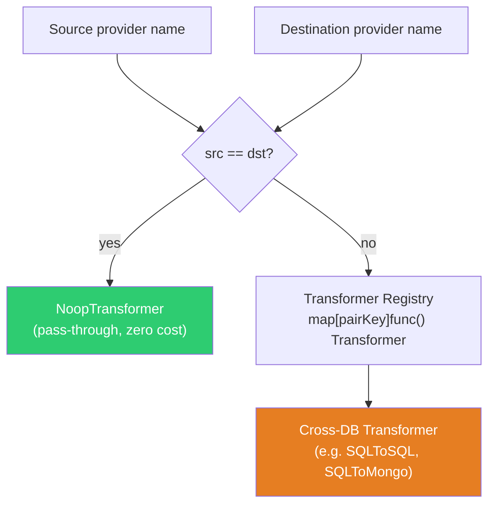
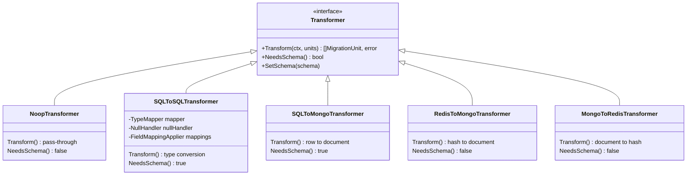
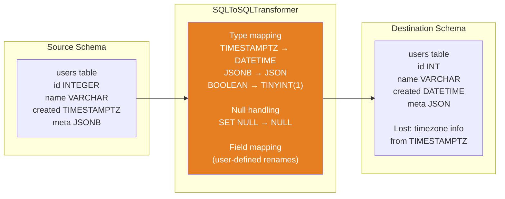
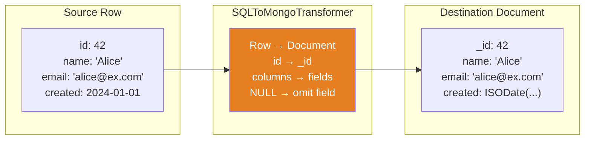
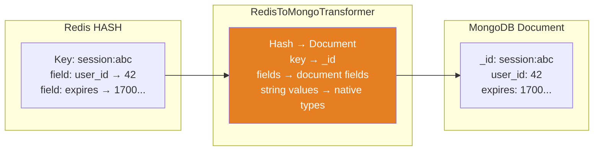

# Transformation Layer

The transformation layer converts data between provider formats when the source and destination use different database engines. Same-engine migrations (e.g. Postgres to Postgres) skip this step entirely with a `NoopTransformer`.

## How transformations are resolved

## Transformer interface

## Transformation cases

### SQL to SQL (e.g. Postgres to MySQL)

### SQL to NoSQL (e.g. Postgres to MongoDB)

### NoSQL to NoSQL (e.g. Redis to MongoDB)

## Configuration

Transform behavior is controlled by pipeline config:

| Setting      | Purpose                                                    |
| ------------ | ---------------------------------------------------------- |
| `NullPolicy` | How to handle NULL values (`propagate`, `omit`, `default`) |
| `Mappings`   | Per-table field rename rules (e.g. `user_name → username`) |
| `TypeMapper` | Auto-selected based on source/dest provider pair           |

## Lossy conversions

The migration plan (`MigrationPlan.UnsupportedFields`) reports any type mappings that lose information:

| Source Type   | Destination Type | Information Lost        |
| ------------- | ---------------- | ----------------------- |
| `TIMESTAMPTZ` | `TIMESTAMP`      | Timezone offset         |
| `JSONB`       | `JSON`           | Nested query capability |
| `MONEY`       | `DECIMAL`        | Currency symbol         |
| `UUID`        | `VARCHAR`        | Type-level validation   |
